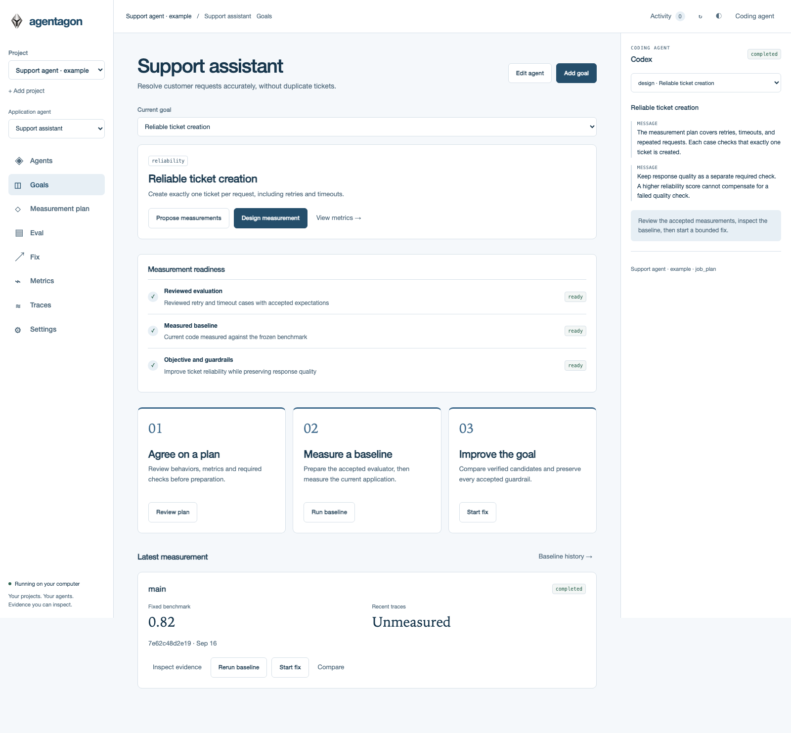

<p align="center">
  <a href="https://agentagon.ai">
    
  </a>
</p>

<h1 align="center">Agentagon</h1>

<p align="center">
  <strong>Turn AI-agent goals and production failures into measured, verified code improvements.</strong>
</p>

<p align="center">
  A local web app that connects your code, coding agent, traces, and evaluations—then establishes a baseline and compares fixes before you ship.
</p>

<p align="center">
  <a href="https://agentagon.ai/docs/"><strong>Docs</strong></a> ·
  <a href="#installation"><strong>Install</strong></a> ·
  <a href="#quick-start"><strong>Quick start</strong></a> ·
  <a href="https://github.com/agentagon/agentagon/issues/new/choose"><strong>Report a bug</strong></a>
</p>

<p align="center">
  <a href="https://pypi.org/project/agentagon/">
    
  </a>
  <a href="https://github.com/agentagon/agentagon/actions/workflows/tests.yml">
    
  </a>
  <a href="https://pypi.org/project/agentagon/">
    
  </a>
  <a href="LICENSE">
    
  </a>
</p>

<p align="center">
  <strong>Local-first · Codex + Claude · Braintrust + LangSmith + Langfuse</strong>
</p>

<p align="center">
  If Agentagon looks useful, <a href="https://github.com/agentagon/agentagon"><strong>⭐ star the repository</strong></a>.
  It helps other agent builders discover the project.
</p>

Agentagon helps you decide what an AI agent should improve, define how success will be measured, establish a reproducible baseline, and compare verified code changes.

The browser guides the workflow. Coding agents perform reasoning and author changes; Agentagon owns evaluations, budgets, evidence, comparisons, and review boundaries.



*Example workspace with synthetic data. Define a goal, agree on measurements, establish a baseline, then compare fixes.*

## Prerequisites

- **Python 3.12+** with `pip` and `venv`, on macOS or Linux. The implementation uses Unix facilities such as `fcntl`.
- **Git** to review changes and run evaluation or fix workflows. Full code audits also accept directories without Git.
- **Codex CLI with working authentication**, or the optional **Claude Agent SDK with an Anthropic API key**, for tasks that use a coding agent. Skill installation is not required by the web app.

Installation downloads Python dependencies. No Agentagon account or API key is required for the quickstart or core workflows; your coding host and configured services have their own access requirements.

## Installation

Install the CLI from PyPI using [pipx](https://pipx.pypa.io/stable/installation/):

```sh
pipx install agentagon
cd /path/to/your-agent
agentagon
```

The command opens the web app and reuses an existing local service when available. Keep its launching terminal open while tasks run. Downloadable wheels, source archives and checksums are also available in [GitHub Releases](https://github.com/agentagon/agentagon/releases).

Optional extras are `agentagon[claude]` for the Claude Agent SDK and `agentagon[credentials]` for OS credential storage. Select both at installation with `pipx install 'agentagon[claude,credentials]'`. Claude's managed integration requires API-key access; it does not use subscription authentication.

For source installation in an isolated environment:

```sh
git clone https://github.com/agentagon/agentagon.git
cd agentagon
python3 -m venv .venv
. .venv/bin/activate
python -m pip install .
agentagon --help
```

Ensure `python3 --version` reports 3.12 or newer. Keep this environment active for the following commands; reactivate it in each new shell.

To use skills inside an existing coding host, run `agentagon install --host codex` or `agentagon install --host claude-code`, then start a new host session. See the optional [plugin installer](https://github.com/agentagon/agentagon/blob/main/docs/audit.md#install).

Anonymous skill and Intelligence usage telemetry is enabled by default. Disable it with `agentagon setup --scope user --set telemetry.enabled false` or `AGENTAGON_TELEMETRY_DISABLED=1`. See [collected fields, privacy and delivery](https://github.com/agentagon/agentagon/blob/main/docs/telemetry.md).

Optional Agentagon Intelligence is available through live `/v1/audit`, `/v1/eval` and `/v1/fix` routes. Configure the issued origin explicitly and follow the [workflow-specific request and privacy rules](https://github.com/agentagon/agentagon/blob/main/docs/intelligence.md).

## Quick start

Run `agentagon` from **your AI agent's code directory**. `agentagon app` is an alias; the project selector lets you add and switch local directories.

1. In **Settings → Coding agents**, select Codex and a model from its installed catalog, or configure Claude API-key access and its model.
2. Optionally connect Braintrust, LangSmith or Langfuse under **Settings → Connections** for this project. Enter credentials, choose **Find projects**, select a remote project and connect. Preview selected traces or a dataset before importing.
3. In **Agents**, discover and confirm application agents or add one manually. Open **Goals**, add a focus describing what matters, and accept its **Measurement plan**.
4. Use **Eval** to prepare a trusted benchmark, **Run baseline** to measure it, and **Fix** to compare improvements. Existing compatible evidence can be reused.

Review task progress, questions and permission requests in the browser. Closing the browser leaves tasks running; stopping the local service interrupts them until you explicitly resume. Dataset imports remain drafts until expectations, execution and independent review are ready. See the [web app guide](https://github.com/agentagon/agentagon/blob/main/docs/app.md) for setup and limits, or the [skill quickstart](https://github.com/agentagon/agentagon/blob/main/docs/getting-started/first-audit.md) for the optional host-driven path.

Optional examples: [check your installation offline](https://github.com/agentagon/agentagon/blob/main/examples/local-audit/README.md), or [compare fixes in the ticket-retry demonstration](https://github.com/agentagon/agentagon/blob/main/examples/ticket-retry/README.md).

## Workflows

| Goal | Web app and result |
|---|---|
| Decide what to improve and how to measure it | [Goals and measurement plans](https://github.com/agentagon/agentagon/blob/main/docs/app.md#select-an-application-agent-and-focus): accepted behaviors, scores, required checks and evaluation choices. |
| Improve a saved goal or named issue | [Fix](https://github.com/agentagon/agentagon/blob/main/docs/fix.md): bounded optimization, verified comparisons and local delivery. |
| Define behaviors, custom scores and evals | [Eval](https://github.com/agentagon/agentagon/blob/main/docs/eval.md): agreed expectations, reviewed evaluations and reusable benchmarks. |
| Inspect history, rerun a baseline or manage settings | [Agents, Metrics, Eval and Settings](https://github.com/agentagon/agentagon/blob/main/docs/app.md): agent focuses, retained measurements, explicit reruns and connections. |

The optional `ag` skills and existing CLI commands remain available, including [Audit](https://github.com/agentagon/agentagon/blob/main/docs/audit.md) for a separate investigation. The web-app journey starts from goals; existing audits and saved findings remain available as evidence. Discovery accepts dirty or non-Git directories; measurement requires clean committed inputs and authorized limits. Without a runnable baseline, Fix reports the blocker; an unmeasured application patch requires an explicit request. Publication, merge and deployment remain separate actions.

Intelligence is optional and asks for approval of each outgoing request by default. Set its explicit **full access** mode through Setup to skip prompts while keeping calls visible. See [Intelligence permissions](https://github.com/agentagon/agentagon/blob/main/docs/intelligence.md).

## Configuration and saved data

The code-only quickstart needs no trace-provider connection, evaluation setup or Intelligence key. To inspect settings for your current directory:

```sh
agentagon setup
```

| Setting or location | Purpose |
|---|---|
| `--workspace PATH` before the subcommand | Select the application directory; defaults to `.` |
| `AGENTAGON_CONFIG` | Override the configuration file path |
| `$XDG_CONFIG_HOME/agentagon/config.json` | Default settings file; falls back to `~/.config/agentagon/config.json` |
| Sibling `config.app/app.sqlite3`; `AGENTAGON_APP_STATE` overrides its directory | Authoritative app metadata: projects, agents, focuses, project connections, settings, jobs and approvals |
| `.agentagon/` in the application directory | Engine records, immutable evidence, reports and work areas; initialization excludes it from Git |

Project overrides take precedence over user defaults. App provider connections automatically use an OS credential store when available, with session memory as the fallback. CLI and execution settings use credential references; secret values are not saved in configuration. Use [web-app settings](https://github.com/agentagon/agentagon/blob/main/docs/app.md) for connections and agents, [execution profiles](https://github.com/agentagon/agentagon/blob/main/docs/fix.md#configure-execution-once) for evaluations and fixes, and [Intelligence setup](https://github.com/agentagon/agentagon/blob/main/docs/intelligence.md) for optional guidance.

The app is hosted locally on loopback; hosted/team access is deferred. Evidence is stored locally, while your coding host and configured services determine where model processing occurs. There is no legacy app-state migration; connect each local project's providers explicitly.

## Development and contributing

See [CONTRIBUTING.md](https://github.com/agentagon/agentagon/blob/main/CONTRIBUTING.md) for editable installation, local development, tests and the pull request workflow. The [documentation index](https://github.com/agentagon/agentagon/blob/main/docs/README.md) links deeper guides and references.

To explore the implementation, start with [how Agentagon works](https://github.com/agentagon/agentagon/blob/main/docs/contributing/architecture.md) and the [extension walkthrough](https://github.com/agentagon/agentagon/blob/main/docs/contributing/extending.md). Maintainers can follow [release preparation](https://github.com/agentagon/agentagon/blob/main/docs/contributing/releasing.md).

Report vulnerabilities through [SECURITY.md](https://github.com/agentagon/agentagon/blob/main/SECURITY.md). Participation follows the [Code of Conduct](https://github.com/agentagon/agentagon/blob/main/CODE_OF_CONDUCT.md).

## License

[Apache-2.0](https://github.com/agentagon/agentagon/blob/main/LICENSE).
