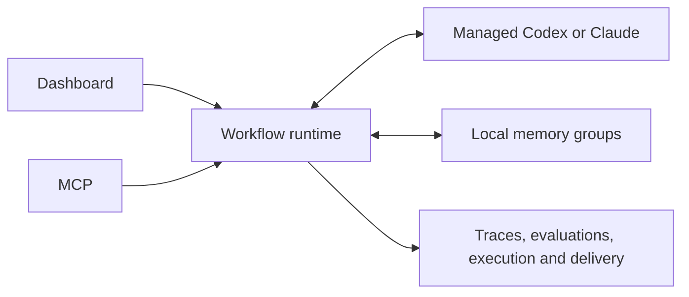

# Agentagon

**Recursive self-improvement for AI agents.**

Improve agents using code, traces and verified experiments. Remember successes, failures and production outcomes to guide the next attempt.

Agentagon has five concepts: a **dashboard** for people, a managed coding **brain** for reasoning, **memory** groups for lessons, built-in **workflows** for repeatable work, and shared **capabilities** for evidence and execution. Dashboard and MCP use one local service and one task runtime.



## Install and start

Requires macOS or Linux, Python 3.12+, Git for executable evaluations, and an authenticated Codex CLI or the optional Claude Agent SDK with API-key access.

```sh
pipx install agentagon
cd /path/to/your-agent
agentagon
```

`agentagon` opens the React dashboard and starts or reuses a detached local service. Closing the browser or terminal does not cancel tasks. `agentagon serve` runs that service in the foreground; `agentagon mcp` serves stdio MCP without opening a browser. Optional extras: `agentagon[claude,credentials]`.

## Set up your improvement loop

Add or clone a repository, configure the managed coding backend, and optionally connect observability or import a trace. **Analyze project** discovers application agents, proposes code/trace bindings, and recommends next actions. Confirm ownership before repairs. Missing authentication preserves the local scan and acquired evidence.

Each agent has persistent improvement history and production observations. Enable monitoring explicitly for an agent and environment. Checks run hourly while the local service and machine are available; scheduled diagnosis runs at most daily with a five-minute limit. Interrupted tasks require explicit resume or discard. Monitoring recommends actions; users start repairs and select/deploy changes.

## Choose a journey

- **Assess project:** discover agents and next actions from selected code and traces.
- **Observe production:** retain bounded observations, compare declared release cohorts, and recommend the next improvement.
- **Discover issues:** import selected traces, diagnose and group supported failures, then choose what to address. Discovery does not launch repairs.
- **Fix:** supply an issue, a trace, or a problem description. Establish expected behavior, reproduce the failure, author one focused repair, and verify it with independent review. A saved goal and full audit are optional.
- **Optimize:** define a broader goal, accept a measurement plan, prepare an evaluator and baseline, then compare bounded, verified alternatives.

Evaluation preparation, baseline measurement, measurement design, and full Audit are also built-in workflows. Explicit full audits retain the complete rubric and selected code/trace scope.

The service owns task budgets, pending questions, cancellation, and resumption. After a service interruption, resume explicitly. Verified repairs identify the tested source revision; they do not prove production recovery or authorize publication, merge, or deployment.

## Memory and evidence

Named local memory groups can live in separate folders with explicit project/agent access. Improvement lessons and target-agent memory share an interface but use separate bindings. Entries are versioned, bounded, and carry evidence references. Evaluations pin target-agent memory so concurrent writes cannot change comparisons. MCP exposes explicit recall and record operations.

SQLite owns mutable project, agent, goal, issue, task and memory-registry metadata. Immutable evidence stays in private project storage. Provider adapters retain normalization, redaction, provenance, integrity checks and import bounds. Optional Intelligence uses separately approved, privacy-safe requests.

This breaking release requires fresh application and project state. Existing private data is left untouched. There are no migrations, old CLI aliases, installed public skills, plugin manifests, or host continuation hooks.

Read the [production monitoring guide](docs/production.md), [dashboard guide](docs/app.md), [MCP contract](docs/mcp.md), [memory guide](docs/memory.md), [architecture](docs/contributing/architecture.md), and [contribution guide](CONTRIBUTING.md).
