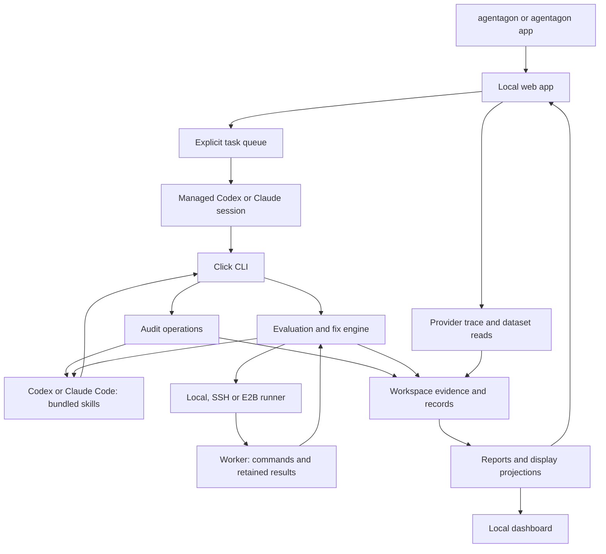

# How Agentagon works

Agentagon separates coding-agent judgment from repeatable local mechanics. Managed or host-driven coding-agent sessions read evidence, author changes and supply independent reviews. Python captures inputs, validates records, executes bounded checks and saves results. The local web app is the primary interface and manages explicitly started tasks across registered projects.

Start with the [local example](../../examples/local-audit/README.md) to see an evidence packet and partial report. This guide explains the implementation behind that workflow. The [implementation map](capabilities.md) provides more detailed source and test links.

## Entry points and components

Both `agentagon` and `python -m agentagon` call the Click command group in [cli/main.py](../../src/agentagon/cli/main.py). The executable is declared in [pyproject.toml](../../pyproject.toml); module execution uses [__main__.py](../../src/agentagon/__main__.py).

Without a subcommand, the CLI launches or reuses the local web app; `agentagon app` is an alias. [webapp/](../../src/agentagon/webapp/) owns project registration, session-validated browser actions, immutable provider imports and durable task coordination. Named workflow subcommands retain their existing behavior. App-managed sessions receive bundled workflow references without requiring host plugin registration.

The bundled [skills](../../skills/) expose primary `init`, `fix` and `dashboard` journeys plus standalone `audit`, `eval` and supporting `setup`. Shared eval authoring, independent review and delivery compose these journeys using validated low-level CLI operations. [installation.py](../../src/agentagon/installation.py) copies the skills and their references into a managed local marketplace and invokes each host's native plugin manager.

The [native hook bundle](../../hooks/hooks.json) invokes the hidden `agentagon fix hook` command for host lifecycle events. [Hook handling](../../src/agentagon/experiments/hooks.py) preserves session context and continuation state; a session-start event does not launch work. Runners invoke [worker.py](../../src/agentagon/experiments/worker.py) separately to execute trial commands.

Arrows show calls and returned evidence. The app continues explicitly started tasks while its service runs; host-driven workflows wait for the active coding-agent task. Optional legacy dashboard controls remain separate.

| Component | Responsibility | Source |
|---|---|---|
| Command layer | Parse options, resolve settings and return JSON | [cli/main.py](../../src/agentagon/cli/main.py) |
| Web application | Register projects, manage agent sessions and task controls, import provider snapshots | [webapp/](../../src/agentagon/webapp/) |
| Audit operations | Capture scope; prepare, accept and resume host work | [operations.py](../../src/agentagon/operations.py) |
| Evidence storage | Resolve the workspace, snapshot code, hash artifacts and serialize writes | [workspace.py](../../src/agentagon/storage/workspace.py), [changes.py](../../src/agentagon/storage/changes.py) |
| Trace processing | Select roots, normalize exports, retain provenance and flag alignment limits | [telemetry/](../../src/agentagon/telemetry/) |
| Measurements and validation | Compute diagnostic signals, validate judgments and enforce JSON schemas | [signals.py](../../src/agentagon/core/signals.py), [analysis.py](../../src/agentagon/core/analysis.py), [records.py](../../src/agentagon/core/records.py) |
| Evaluation preparation | Prepare and check a benchmark, then freeze its independently reviewed package | [preparation.py](../../src/agentagon/experiments/preparation.py) |
| Candidate experiments | Freeze comparisons, manage worktrees, execute trials and retain verified alternatives | [engine.py](../../src/agentagon/experiments/engine.py), [checkouts.py](../../src/agentagon/experiments/checkouts.py), [evaluation.py](../../src/agentagon/experiments/evaluation.py) |
| Execution | Dispatch and collect durable attempts; run commands and retain bounded evidence | [runners.py](../../src/agentagon/experiments/runners.py), [worker.py](../../src/agentagon/experiments/worker.py) |
| Host coordination | Reserve work, track host assignments, process controls and resume sessions | [orchestration.py](../../src/agentagon/experiments/orchestration.py), [controls.py](../../src/agentagon/experiments/controls.py), [hooks.py](../../src/agentagon/experiments/hooks.py) |
| Presentation | Build reports and bounded read views; serve dashboard assets on loopback | [reporting.py](../../src/agentagon/reporting.py), [inspection.py](../../src/agentagon/experiments/inspection.py), [dashboard.py](../../src/agentagon/dashboard.py) |

[Config](../../src/agentagon/storage/config.py) supplies shared defaults and checkout overrides. [Issue history](../../src/agentagon/storage/issues.py) combines audit groups with recorded status events. The optional [Intelligence client](../../src/agentagon/lookup/client.py) sends separately prepared context; it does not replace local evidence or host judgment.

The app keeps a user-local registry alongside Config and routes every workflow to a registered checkout. Its managed-agent adapter uses Codex app-server over stdio or the optional Claude Agent SDK with API-key authentication. Session IDs, explicit approvals and job state are retained independently of browser connections. A service restart marks unfinished work interrupted; only explicit resume advances it. See [the app guide](../app.md) for dependency and lifecycle requirements.

## Follow an audit through the system

1. **Initialize and select scope.** `init` creates private workspace state. `audit start` captures either the current source or the selected local changes. Full code audits split text into 100-line units; changes reviews use captured hunks and bounded context.
2. **Import traces when requested.** The app previews bounded provider reads and saves an immutable snapshot, or a host supplies a compatible local export. `audit plan` records a metadata selection; `audit import` checks the acquisition receipt when a plan exists. The importer reads JSON/JSONL/NDJSON, redacts recognized credentials and normalizes spans. It validates records, groups traces and computes measurements. Malformed rows and missing evidence remain coverage limits.
3. **Prepare an evidence packet.** `audit prepare AUDIT_ID --stage evidence` selects pending units and writes a bounded packet plus response template. The packet contains evidence identifiers and required rubric judgments. Larger content remains available through referenced files.
4. **Accept host judgments.** The host fills the response and calls `audit submit`. Validation checks the schema, packet identity and digest, current captured inputs, required judgments and citations. An untouched template keeps work pending.
5. **Diagnose and group.** Evidence judgments enable diagnosis packets. The host records findings and accounts for diagnostic flags, including dismissed flags. Clustering packets group findings into issues when findings remain unassigned.
6. **Inspect or resume.** `status` reports the next action. `audit report` writes Markdown and JSON with findings and coverage. The dashboard reads saved evidence and report projections.

The next-action order is `import` when needed, then `evidence`, `diagnosis`, and `clustering` when findings need grouping. Completion is `complete` or `complete_with_limits`; it does not establish that every possible defect was found. See [commands and submissions](../../skills/audit/references/records.md) for packet fields, batch limits and resumption rules.

Source: [audit operations](../../src/agentagon/operations.py), [trace importer](../../src/agentagon/telemetry/ingest.py), [report generation](../../src/agentagon/reporting.py). Representative checks: [audit tests](../../tests/test_audit.py), [changes reviews](../../tests/test_review_flow.py), [provider exports](../../tests/test_telemetry.py).

## Follow a measured improvement

`eval start` creates an isolated benchmark preparation worktree from clean committed inputs. The host supplies a plan and benchmark changes. `eval check` executes declared checks, including negative cases; `eval freeze` requires the matching independent review. The resulting package can supply a fix specification.

`fix start` accepts that package or an explicit specification and a saved execution profile. The engine freezes evaluation files, inputs, seeds, checks, objectives and limits before measuring the baseline. Candidate worktrees give host authors separate editable files while preserving the comparison.

A trial passes through the runner to the worker. The worker launches declared commands and captures exit status, logs, source identity and bounded task evidence. Results return through the runner for engine validation. A candidate needs feasible measurements and an accepted independent review before it joins the verified alternatives. The Pareto frontier retains candidates that no other verified candidate dominates across all objectives.

The user selects a candidate. Delivery preparation and publication use [delivery.py](../../src/agentagon/experiments/delivery.py); cleanup uses [cleanup.py](../../src/agentagon/experiments/cleanup.py) and requires fresh measurement and review. Selection does not merge or deploy a change.

Use the existing [evaluation guide](../eval.md), [fix guide](../fix.md), [host coordination guide](../orchestration.md) and [task evidence reference](../task-evidence.md) for the operational contracts.

## Where state lives

Paths below are relative to the application's `.agentagon/` directory. In a Git checkout, the workspace resolves to its checkout root. Agentagon does not require a separate database for these records.

| Location | Contents |
|---|---|
| `workspace.json` | Workspace contract metadata |
| `evidence/` | Content-addressed retained artifacts; reads check the content hash |
| `audits/AUDIT_ID/` | Audit state, prepared packets and response templates |
| `reports/AUDIT_ID/` | Generated audit Markdown and JSON |
| `evaluations/EVALUATION_ID/` | Benchmark preparation state and work |
| `runs/RUN_ID/` | Frozen experiment state, active candidate worktrees, attempts and explicitly exported fix reports |
| `cases/events/` | Issue status events |
| `webapp/imports/` | Immutable private trace and dataset snapshots with provenance and completeness |
| `webapp/jobs/` | Managed task state, session identity, questions and retained progress |

These files are workflow state, not configuration inputs to edit manually. Use app actions or CLI operations; only prepared host responses/templates are intended for authoring. Settings live in the separate user-local file described in [configuration](../settings.md). The app registry defaults to the settings path with a `.app` suffix, with `AGENTAGON_APP_STATE` as an override. Removing a registry entry preserves checkout evidence.

Provider datasets retain structured inputs and references as drafts. The import adapter pins the provider version where available and records incomplete selections. Evaluation materialization copies selected data into private evaluator inputs, separately from delivered source; imports do not replace harness preparation, accepted expectations or independent review.

[Workspace writes](../../src/agentagon/storage/workspace.py) use atomic replacement and an exclusive audit writer lock. [Experiment storage](../../src/agentagon/experiments/store.py) uses per-run file locks, verifies frozen specification/profile digests and exports reports on request. [Task evidence](../task-evidence.md) explains shared result storage; the [fix reference](../reference/fix.md) describes finished worktree cleanup. See [issue history](../../skills/audit/references/history.md) before changing status semantics.

## Decisions to preserve

| Decision | Why it matters | Detailed rule |
|---|---|---|
| Host judgment stays separate from measurement | Structural validation can bind evidence; it cannot prove a model's conclusion | [Measurement and user choice](product-decisions.md#fixes-preserve-measurement-and-user-choice) |
| Review scope stays attached to captured changes | A narrow review must not silently become a full audit | [Separate triggers](product-decisions.md#separate-triggers-define-the-evidence-scope) |
| Goals steer emphasis without removing rubric requirements | An optimization goal must not hide unrelated required checks | [Goals](product-decisions.md#goals-change-emphasis) |
| Configuration and immutable run inputs stay separate | New defaults must not alter an existing comparison | [Configuration scopes](product-decisions.md#one-config-file-two-settings-scopes) |
| Dashboard reads use one checkout's display projections | Inspection must not execute work or reconnect to runners | [Dashboard scope](product-decisions.md#dashboard-covers-one-checkout) |

Both browser interfaces are local loopback services with exact-host checks. The primary app validates browser sessions and origins before mutations and scopes tasks to registered projects. The legacy dashboard remains read-only by default; `--controls` explicitly enables its validated operations. Neither interface is a shared hosted deployment service. See [dashboard controls](../reference/fix.md#dashboard-controls-and-delivery) and [server tests](../../tests/test_dashboard.py).

Local worktrees isolate files, not machine or network access. Remote worker and Python event helper code remain compatible with Python 3.10 and the standard library. [Runner boundaries](../reference/fix.md#configure-execution-once) and [task evidence](../task-evidence.md) explain these constraints.

## Interfaces and extension points

For command options, use `agentagon --help`, `agentagon audit --help`, `agentagon eval --help` and `agentagon fix --help`. Most workflow commands return JSON; `AuditError` becomes an error object on stderr with exit status 1. Click usage errors and the foreground dashboard server have their own output paths.

Use the CLI and [versioned records](../../contracts/v1/) when integrating with workflows. `agentagon resources` locates installed contracts, skills and the signal catalog. Python modules and dashboard routes are implementation entry points; this guide does not establish a separate SDK or HTTP compatibility promise.

The existing references cover the interfaces that need field-level documentation:

- [Audit submissions](../../skills/audit/references/records.md): evidence packets, citations and judgments.
- [Trace formats](../../skills/audit/references/formats.md): supported local exports and normalization limits.
- [Fix specification](../../skills/fix/references/contract.md): evaluation and execution inputs.
- [Task evidence](../task-evidence.md): benchmark result channels, event helpers and artifacts.

Try [extending trace normalization](extending.md) for a worked change from input fixture to observable output. For new packaged resources, follow [packaging checks](README.md#packaging-checks) and [release preparation](releasing.md).
