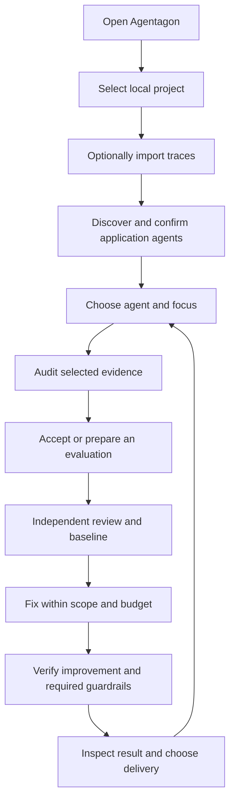

# Agent-centered workflows and durable application state

Status: implemented local iteration. The agent/focus interface, SQLite app metadata, upstream GEPA reflection transport and whole-suite verification are implemented. Focused engine and managed-task tests cover suite guards, budget limits and interruption/resumption; the checklist below remains the release validation scope. A sealed holdout lifecycle and hosted operation are deferred.

## Accepted scope

1. Keep one executable: bare `agentagon` opens or reuses the local app; `agentagon app` is an alias and named commands remain available.
2. Make application agents the primary product objects. Audit, Eval and Fix are connected activities within a selected agent and versioned focus.
3. Use an app-managed SQLite database as the authority for structured app metadata. Keep engine records, immutable evidence and Git work areas in each project's filesystem.
4. Support existing local directories and explicit GitHub clones. Trace connections are optional. Discovery produces suggestions that users confirm; dirty and non-Git code remain valid audit inputs.
5. Save accepted objectives, measurements and guardrails with focus versions. New focuses must preserve earlier accepted checks.
6. Keep diagnosis, evaluator preparation, baseline measurement and optimization distinct. Trace observations and audit judgments do not automatically become benchmark labels.
7. Remove GEPA's custom proposer. Use its default prompt construction and response extraction through a durable callable `reflection_lm` transport.
8. Expose Codex's installed model catalog in Coding agents settings and validate the user's choice. Keep separate model settings for Codex and Claude.
9. Build for local hosting in this iteration. Do not add legacy migration, compatibility writers, cloud deployment or hosted account infrastructure.

## Agent and focus journey



### Select code and tools

Launching from a directory registers that canonical checkout. Users can add another local directory or explicitly clone a GitHub HTTPS repository into a new local destination using their local Git authentication. Separate Git worktrees remain separate projects. There is no GitHub App or hosted repository integration in this scope.

Braintrust, LangSmith and Langfuse have separate named connection forms and explicit project assignments. Saving a connection starts no collection. Imports preview a bounded population and retain provenance, completeness and source-revision uncertainty.

Coding agents are separate from the application agents being evaluated. Codex uses app-managed app-server sessions and a model chosen from `model/list`; Claude uses the optional Agent SDK with API-key authentication. Their configuration is separate from the execution profiles that run evaluations. Discovery itself is a bounded local scan, not an automatic model request.

### Confirm application agents

The inventory proposes agents from recognized code entrypoints and imported trace metadata. Each suggestion identifies its evidence and requires confirmation. Users can edit names and scopes or add agents manually; automatic merge/split inference is not implemented.

An application agent has a stable ID and versioned code scopes, shared dependencies and trace selectors. A trace-only agent can be investigated through matching imported evidence; measured source changes require a confirmed code binding. Unmatched and unavailable evidence remain visible limits. Discovery is not claimed to be exhaustive.

### Choose what matters

A focus records a goal and optional target. Its source can be a stated objective, a saved issue or a bounded selection of recent traces. Categories are correctness, reliability, grounding, safety, security, latency, cost, interaction and custom objectives. These categories do not silently enable generic judges or invent a health score.

An investigation plan records the confirmed agent binding, focus version, code scope, selected immutable traces and fixed audit rubric. Focus controls emphasis within that scope. Full-project audits remain a separate entry point. A narrow audit cannot resolve unrelated historical issues by failing to observe them.

Recent-trace selection preserves complete root-trace groups, selection bounds and incomplete-source limits. A failure-filtered sample can support diagnosis but cannot estimate a production-wide failure rate. Missing labels remain unknown.

### Prepare trustworthy measurement

Use an existing reviewed evaluator when it fits the focus. Otherwise prepare one from requirements, imported datasets, trace-derived drafts or confirmed failures. Accept the metric, direction, correctness rule, constraints, execution profile and budget explicitly. Production outputs and generated answers are not ground truth by default.

Dataset drafts preserve provenance, structured conversations, missing expectations and unsupported attachments. Related cases are grouped before development/final splitting. Development inputs can be materialized for preparation; final-test use requires explicit handling and a separately reviewed evaluator. This does not automatically create a final evaluator, isolate a sealed holdout or establish independent generalization. A complete sealed-holdout lifecycle remains future work.

Measurements require clean committed source, runnable entrypoints, accepted expectations and scoring, validation, sensitivity checks and independent review. Diagnosis can still inspect dirty or non-Git code. A baseline binds source revision, evaluator and dataset identity, scoring/judge definition, execution settings and evidence status.

### Preserve prior focuses during Fix

The accepted design retains all active focus checks and includes other registered agents affected by permitted changes or shared dependencies. Fix readiness must identify missing evaluations and baselines, with preparation or narrower scope as the next action. Missing checks must never become implied passes.

The implemented suite coordinator binds evaluator digests, focus versions, guardrails and execution profiles in an immutable manifest before optimization. It measures reference and finalist sources separately for each member in isolated execution snapshots under one shared budget, protecting final-verification capacity and enforcing the accepted task timeout. Existing frozen evaluator packages are reused without merging their fixtures, metric names or runners.

A candidate must improve the selected objective and satisfy every required check. Earlier focuses remain separate guardrails; a weighted average cannot hide a failure. Results must retain exact source identities, per-member measurements, review evidence and failed attempts. If required verification cannot finish within the budget, retain that limit rather than claim complete improvement.

Single-evaluator Fix continues to retain its strongest verified result and up to two qualifying alternatives. A suite binding verifies one finalist; measured alternatives remain experiment details. A failed suite retains the original baseline with its failure evidence, while missing or unfinished checks cannot become a completed improvement. Selection and delivery both revalidate the exact suite-bound source. Selecting a result, promoting a reference baseline, publishing a draft PR, merging and deploying are separate actions.

## Interface

The project landing page is **Agents**, showing confirmed and suggested application agents. Inside an agent, use these destinations with a contextual coding-agent panel:

| Destination | Main purpose |
| --- | --- |
| Overview | Focus, readiness, current evidence and active work |
| Audit | Investigate the selected focus and inspect findings |
| Eval | Prepare evaluations, inspect dataset drafts and establish baselines |
| Fix | Check prerequisites, run bounded optimization and inspect verification |
| Metrics | Retained measurements, evaluator versions and accepted guardrails |
| Traces | Imported evidence, selection and provenance |

Global settings retain Connections, Coding agents, Execution, Project defaults and Privacy & Intelligence. Navigation and mutations identify the project, application agent, focus and task explicitly. Switching projects leaves running tasks attached to their original project. Returning users can start from compatible saved evidence instead of repeating onboarding.

Metrics must distinguish incompatible definitions or execution conditions. Changing the dataset, scorer, judge or execution profile cannot silently create a comparable trend. Descriptive recent-trace scores remain separate from controlled benchmark comparisons.

## Storage and task ownership

The implemented local store is `config.app/app.sqlite3`, with `AGENTAGON_APP_STATE` as a directory override. SQLite owns project registrations, application agents and bindings, focuses, named connection references, coding-agent preferences, jobs, events and approvals. It uses short serialized transactions and rollback journaling. Model calls, provider reads, Git work and measurements execute outside database transactions.

Project `.agentagon/` directories retain engine records, immutable imports and checksum-addressed artifacts, reports and isolated work areas. Task context/config files are generated inputs and projections; they are not an alternative task database. Both database and filesystem evidence are needed for a complete backup.

This iteration does not import old app JSON state, synthesize connections from CLI settings, introduce compatibility writers or migrate every engine record into SQLite. Unsupported database versions fail explicitly. CLI execution configuration keeps its existing invocation/project/user precedence; accepted runs freeze the effective settings.

Task acceptance atomically binds the raw submission to its operation ID. Retrying the same submission returns the recorded task even if settings or focus bindings subsequently change; a different submission cannot reuse the operation ID. Persist native host sessions and review/reflection identities. Reloading the browser does not restart work, while service interruption requires reconciliation and explicit resume.

Database transactions cannot guarantee exactly-once external model or runner effects. A claimed native call without a saved session cannot silently launch a replacement; unresolved work remains actionable. Approval rejection, cancellation, malformed output and failed measurements remain evidence. Separate reviewer sessions and shared host capacity preserve author/reviewer boundaries.

There is no hosted implementation in this scope. A later design must separately address authenticated organizations, tenant-scoped storage, worker identities, secret delivery and an outbound authenticated connector for local execution. PostgreSQL and object storage are possible later choices, not current dependencies. Never expose the loopback service as a hosted backend.

## GEPA reflection transport

The pinned GEPA 0.1.4 default proposer owns prompt construction and response extraction. Agentagon configures only the reflection callable:

```python
ReflectionConfig(reflection_lm=host_reflection_call)
```

The transport forwards the fully assembled upstream text prompt unchanged and returns exact raw final response text. Agentagon validates the extracted files map against permitted paths and frozen evaluator rules before measurement. AutoResearch and Meta-Harness retain their own proposal contracts.

Each durable reflection request binds the run, stage, logical call, exact prompt digest, backend, model and protocol version. A fresh dedicated native session serves a new request; interruption resumes that exact session. Completed requests replay saved responses without another model call. A private terminal-output checkpoint closes the gap between native completion and bridge reply. Browser progress is sanitized separately and cannot replace the raw response.

Unsupported typed or multimodal prompts are rejected explicitly. Pending work unwinds the upstream call rather than inviting an automatic retry; malformed output and failed attempts remain inspectable. Host work shares the accepted time/cost limits and concurrency. Subscription-backed calls never receive an invented monetary price.

The bridge protocol is versioned. This iteration provides no migration for pending custom-proposer runs. Independently reviewed candidates and measured execution remain required; replacing the proposer does not relax those gates.

## Verification and remaining work

| Area | Required evidence |
| --- | --- |
| Upstream GEPA | Actual pinned engine uses its default proposer; exact prompts, raw finals, replay, uncertain calls, cancellation, malformed output and scope checks are tested without paid calls |
| SQLite metadata | Project isolation, atomic submission binding, stale updates, approval ownership, restart reconciliation and absence of legacy imports |
| Agent/focus journey | Two agents in one project, two worktrees, trace-only scope, dirty/non-Git audit, saved-issue handoff and retained measurement versions |
| Dataset preparation | Trace provenance, grouped splits, missing expectations, development materialization and guarded final use; no sealed-holdout claim |
| Suite verification | A faster candidate that regresses correctness is rejected; member profiles and files remain isolated; all trials count toward one budget and accepted timeout; separate managed reviews bind every child execution while preserving the parent task; resume does not repeat trials; delivery rejects missing or stale suite evidence |
| Browser and packaging | Keyboard use, narrow layouts, reload, project/agent switching, approvals, empty states and long-running tasks; fresh wheel installation includes procedures and contracts |

Provider contract fixtures cover authentication failures, pagination, partial imports, versions and mappings. Real account/model smoke tests require separate authorization and must be reported separately from offline fixtures. Passing fixtures does not establish provider availability or judge accuracy.
