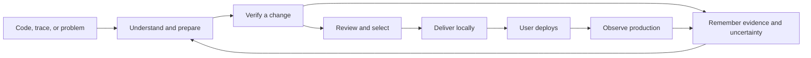
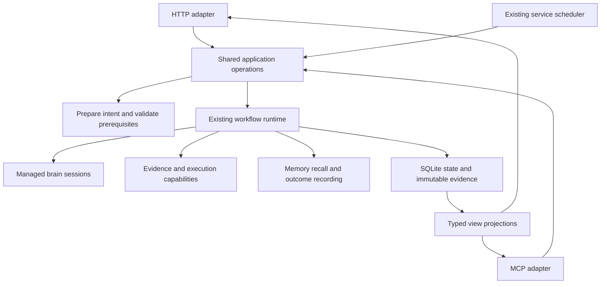

# Agentagon experience plan — version 2

**Status:** core V2 release implemented in the current working tree; final integration validation is tracked separately.  
**Date:** 2026-09-20.  
**Audience:** engineers reviewing, validating, or extending the V2 release.  
**Supersedes:** the UX and implementation recommendations in [version 1](product-experience-overhaul.md). Preserve v1 as history; do not execute both plans.  
**Companion:** [source observations and architectural corrections](product-experience-v2-source-review.md). Final behavior, labels and sequencing are defined here when an exploratory appendix recommendation differs.

**Reading paths:** product decisions and findings are in sections 1–4; exact screens/controls in section 5; backend contracts in section 6; 60 implementation tickets in section 7; later product capabilities in section 9; manual acceptance and coding-agent handoff in sections 10–11.

This document began as the preimplementation audit and specification. Sections 2 and the original screenshot findings remain dated historical evidence about the old interface. The current working tree now implements the core journeys, shared operations, contextual navigation, trace review, issue triage, result decisions, local delivery, production feedback, lesson history, and local funnel described here. Items explicitly labeled later vision remain proposals. Use the current source, public guides, and release validation output as evidence of implemented behavior; this document is not a substitute for those checks.

## 1. The product decision

Keep the positioning **Recursive self-improvement for AI agents**. Make it concrete in the product:

> Understand an agent, establish what good means, verify a useful change, and learn from what happens after it ships.

The unit of value is **a reviewable improvement with evidence and a next action**. An assessment task completing, an agent being registered, or a workflow starting is an intermediate result.

The release must complete these two loops:

1. **Agent improvement:** code/trace/problem → understood behavior → accepted evaluation → verified alternatives → user selection → local delivery → deployment observation.
2. **Learning:** attempted hypothesis → measured outcome and limitations → versioned lesson → cited use or rejection in a later attempt → production update when the conclusion changes.

“Recursive” describes this feedback between attempts. It must not imply that Agentagon rewrites its own verification gates or autonomously deploys code. Production monitoring runs while the local machine and service are available. A future continuously available worker is a separate capability.



### What changes from version 1

| V1 recommendation | V2 decision | Reason |
|---|---|---|
| Seven default tabs per agent, six issue tabs | Four agent tabs; issue detail is one page | Fewer places to search and fewer empty pages |
| Mandatory four-step Fix wizard | One prepared action sheet; expand unresolved requirements only | Known context should not need reconfirming on several screens |
| Confirm inventory before obtaining value | Read-only workspaces for suggestions; confirm exact scope when an action needs it | Users can inspect results and pick one agent without reviewing all 29 |
| Import must always go through investigation before Fix | Preserve direct “Fix this trace” intent | Diagnosis can be an internal stage; ask which issue only when necessary |
| FastAPI, new schema, events/outbox before UX | Extend current operations and projections in vertical slices | Existing runtime, idempotency, revisions, SSE and retry paths already exist |
| A blanket state version 5 | Version only contracts actually changed | A navigation change does not justify invalidating evidence |
| Paths and technical details generally hidden | Source paths, failing spans, diffs and scoring stay readily visible | Engineers need evidence to trust a claim; opaque IDs can be collapsed |
| “Always-on AI engineer” | Explicit local availability and collection coverage | The machine can sleep or the service can stop |
| Long linear issue lifecycle | Separate triage, repair verification, delivery and production facets | Alternatives and overlapping releases do not fit one success flag |
| A large platform backlog first | Complete review/selection/local delivery first | The existing Review screen is currently hardcoded to be empty |

Do not replace the product with a chat interface. Conversation is useful for ambiguous intent and explanations; trace evidence, comparisons, source changes, and production measurements need structured views. A chat transcript cannot be the only place to find the result.

## 2. Historical audit evidence and limits

The preimplementation audit reran the UI walkthrough using the in-app browser. It captured and reopened 20 screenshots. Thirteen showed the existing local project; seven showed a disposable workspace with one synthetic confirmed agent and one ordinary goal. The disposable workspace used the source and packaged frontend assets available during that audit. It had isolated configuration and state, and provider/model execution was disabled. No verified results were fabricated.

No unit tests, automated browser suites, builds, model sessions, provider imports, repairs, or production monitors were run during that audit. The real project was not edited or reconfigured. The only typed problem text was synthetic and was never submitted. The demo service was stopped after inspection. Those observations are a hands-on interface and source audit, not an end-to-end correctness certification of the later implementation.

The service inspected during the audit did not expose a useful build fingerprint. Its loaded backend could not be conclusively equated with every source line. Historical findings are therefore labeled:

- **Live:** observed on the existing product.
- **Demo:** observed on the disposable sample through the real UI.
- **Source:** verified by reading code; not exercised to completion.
- **Proposal:** intended future behavior in this specification.

### Numbered walkthrough

| Step | Captured screen | Health | Finding |
|---|---|---|---|
| E01 | Project Home | High friction | The same agent-review action appears in several surfaces; counts do not explain value |
| E02 | Add project dialog | High friction | Local path and clone URL are mixed; no clear explanation of non-Git support |
| E03 | Agent inventory | High friction | 29 suggestions present, but no responsibility, evidence preview, prioritization or filtering |
| E04 | Confirm agent | Incomplete | Responsibility is blank without an explanation; no exclude action or source excerpt |
| E05 | Issues / trace intake | High friction | Raw provider format is the first decision; issue inventory and import form compete |
| E06 | Fix from the real project | Blocked | “Select an agent” has no inline way to resolve ownership or choose a suggestion |
| E07 | Completed assessment | High friction | Progress chronology precedes the outcome; the useful handoff is near/below the fold |
| E08 | Memory | High friction | Folder registration dominates; the product does not lead with lessons or their influence |
| E09 | Workflow catalog | High friction | Nine internal actions require the user to understand orchestration order |
| E10 | Project setup | Partial | Code and trace scope exist, but an unavailable provider remains selected |
| E11 | Connections | Recovery gap | “Needs credentials” offers Test and Disconnect, without an obvious reconnect flow |
| E12 | Coding backend settings | Partial | Backend is detected, but model/effective limits and readiness are not clear |
| E13 | Execution settings | Empty | Profiles card has neither useful defaults nor a resolving action |
| E14 | Confirmed demo agent | High friction | Large responsibility heading and duplicated goals put useful next actions below the fold |
| E15 | Demo goal | High friction | The user must operate Define → Measure → Improve → Review as separate concepts |
| E16 | Design measurements launcher | Redundant | Agent and goal are requested again after opening the action from that exact goal |
| E17 | Demo Review stage | Incomplete | UI says no verified candidate; source confirms this view is unconditional |
| E18 | Demo Production | Blocked | Enable monitoring is disabled; remedy leads to a different configuration page |
| E19 | Demo trace binding | Dead end | The destination offers only “No trace binding” and no Add connection action |
| E20 | Demo Fix readiness | Misleading | Entering text enables Start without displaying non-Git, execution or regression prerequisites |

E17 is not proof that a completed candidate was lost: the sample had no candidate. The code inspection independently establishes that the page never loads one. E20 is not a demonstrated execution failure: submission was deliberately not attempted. It establishes that the launch UI does not explain known prerequisites.

### Existing strengths to retain

- The product already supports local folders, separately managed coding backends, immutable evidence, independent review, and a shared task runtime.
- Confirmed identity is separate from discovery suggestions.
- Trace and goal entry points are both represented.
- Monitoring acknowledges local service availability in its copy.
- Unknown measurements are sometimes correctly labeled “Not measured yet.”
- The current source filters generic host command messages from public task projections; this work should be retained, not reimplemented as if absent.
- Current assessment code supplies bounded source context and validates inferred responsibilities. Blank historical records need diagnosis and targeted recovery.
- Semantic labels, a skip link, visible focus styling, and Escape dismissal exist. The complete keyboard, focus-restoration, screen-reader, contrast and responsive experience was not established by this audit.

### The five root causes

1. **Starts are easier to find than usable finishes.** Review, compare, select and deliver are incomplete in the UI.
2. **Prerequisites are scattered.** Buttons send users away without preserving the intent they were trying to complete.
3. **The frontend guesses readiness.** It asks a narrower question than the runtime checks during submission.
4. **Evidence is stored but not presented as decisions.** Raw result JSON substitutes for result interfaces.
5. **The product shows every object at the same level.** Workflows, goals, memory storage and connections compete with the agent the engineer is trying to improve.

## 3. Release scope and success criteria

### Ship these complete journeys

**J1 — Understand a local agent:** add local folder → bounded assessment → inspect a suggested agent and responsibility → choose one useful action. No provider, remote Git repository, or exhaustive inventory confirmation required.

**J2 — Fix a supplied failure:** paste/upload/select trace or describe problem → determine the issue and ownership → accept expected behavior and bounds → prepare reproduction → verified repair or explicit limitation → compare, select and deliver locally. A saved goal is optional.

**J3 — Improve behavior:** choose goal or concrete behavior → reuse/create accepted evaluation → baseline → bounded Optimize → verified alternatives → explicit selection and local delivery. Changing the evaluator is never presented as improving the application.

**J4 — Close the production loop:** bind a selected environment → enable bounded monitoring → declare/detect deployment → compare valid cohorts → retain uncertainty → update recommendations and lessons.

**J5 — Return after interruption:** reopen the app → find the same task/question/evidence → answer, resume, cancel or inspect retained work with no duplicate execution.

### Design targets, not measured product claims

- Local folder entry requires one path, with clone as a separate secondary choice.
- After assessment, an agent's responsibility and source evidence are accessible in one click.
- Starting an action from a known issue/agent/goal never requires choosing those identities again.
- Every blocking prerequisite has a resolving action on the same surface or a return path that restores the draft.
- A completed task exposes a useful result without opening JSON.
- Every improvement claim links to source revision, evaluation identity, sample/coverage and limitations within one click.
- One primary recommendation per agent; generic unmeasured possibilities are labeled “Available actions.”
- A user can receive a local branch/patch without configuring GitHub.
- Changing a storage budget does not erase production comparison continuity.

Track task-relevant product metrics locally before making claims: time from registration to first understood agent; time from action intent to accepted start; prerequisite abandonment; result-to-selection and selection-to-delivery completion; repeated question count; false-ready starts; duplicate submissions; fraction of claims with accessible evidence; monitoring coverage gaps. Define start/end events explicitly. Do not send behavioral analytics externally by default.

## 4. Navigation and page hierarchy

### Project shell

Sidebar order: **Overview, Agents, Production, Activity**. Settings is anchored at the bottom. Project switcher includes `Add local project` and a secondary `Clone repository` entry. Keep navigation stable; do not hide Production merely because no provider is connected.

Remove Goals, Memory, Workflows and Connectors from primary navigation. Keep their capabilities reachable through context and Settings. A project-wide Issues list remains reachable via a persistent `All issues` link on Overview/Production, without its own primary sidebar destination. It has an ordinary issue-list search/filter; a new global search system is not required.

Top bar: project name, optional compact branch, connection state, and `Needs you` count only when nonzero. No large path or schema label. An accessible overflow menu holds Help, Diagnostics, About, and appearance preference. Show service availability separately from agent production health.

**Overview** answers: what changed, what needs me, what is the best next action?  
**Agents** answers: what agents exist and what does each own?  
**Production** answers: what is happening in deployed environments and what evidence is missing?  
**Activity** answers: what is running, waiting, complete or interrupted?

### Agent shell

Four tabs: **Overview, Evaluations, Improvements, Production**.

Header shows agent name, one or two lines of responsibility, compact source path/symbol and identity status. `Edit identity`, `Lessons`, and `View activity` are in a labeled More menu. Lessons and issues have deep-link detail pages; they do not need permanently empty tabs.

Overview includes current issues, active goals, recommended action and influential lessons. Evaluations groups accepted checks and goal targets. Improvements contains attempts, candidates and deliveries. Production contains monitors, deployments, observations and coverage.

Allow proposed agents to open read-only workspaces with a `Suggested identity` notice. Only code-writing or persistent binding actions require confirmation of the exact displayed ownership. Do not force every suggestion to be confirmed before one can be used.

This requires a backend policy change, not only an enabled UI link. Allowlisted read-only assessment, discovery and audit may use a frozen proposed binding without confirming or expanding it. They may write their own task/evidence records, but cannot edit application source or turn the proposed identity into accepted measurement/monitor scope. Evaluation enrollment, code-writing and monitoring require exact-scope confirmation. Update shared preparation and submission together; do not remove confirmation checks globally.

### Route contract

Keep existing route names where they already support the target semantics; changing labels does not require changing every URL. Add these missing resource routes with stable IDs:

```text
/projects/:projectId/agents/:agentId/evaluations
/projects/:projectId/issues/:issueId
/projects/:projectId/traces/:snapshotId
/projects/:projectId/improvements/:improvementId
/projects/:projectId/tasks/:taskId/review
/projects/:projectId/production
/projects/:projectId/lessons/:groupId/:entryId
```

Replace old consumers directly when deleting a route. No compatibility wrappers or state migrations are required. A deep link must show a truthful unavailable/removed state rather than silently sending the user to a different project. Filters and selected environment live in URL query state. Back navigation restores the originating list, scroll position and selection.

## 5. Screen-by-screen implementation specification

The following copy is the default English copy. Dynamic values come from structured records. Do not render example numbers as real data. All fields keep their value after a failed request.

### S01 — Welcome and local project entry

Headline: **Recursive self-improvement for AI agents.**  
Supporting sentence: `Find problems, verify improvements, and learn from production outcomes.`

Two visible actions: primary `Open local folder`, secondary `Clone repository`. A small `Try an example` link may open a bundled isolated example only after that example is actually shipped; do not add a dead placeholder button.

Local dialog title: `Open a local project`.

| Control | Behavior |
|---|---|
| Project folder | Required absolute path; trim surrounding whitespace; preserve spaces |
| Choose folder | Render only if the host can return a filesystem path; never upload the folder contents to emulate a picker |
| Helper | `Any local folder works for assessment. Measured changes require a clean Git commit; a GitHub remote is not required.` |
| Continue | Validate and register; pending label `Opening…` |
| Cancel / Close | Close without registration; restore trigger focus |

Validation messages: `Folder not found`, `Agentagon cannot read this folder`, or `This project is already open — Open project`. A duplicate registration navigates to the existing project after confirmation of the exact path; it never creates a second identity.

Clone is a separate dialog: Repository URL, Destination folder, `Clone and open`, Cancel. Authentication errors retain URL/destination. Do not add remote connection requirements to local delivery.

### S02 — Setup and capability preflight

One compact page headed `Start with {project}`. Show code source, coding backend and optional traces in three rows. Each row has its state, consequence and one repair/change action. Put the primary analysis button on the first viewport at desktop widths.

| Row | Visible value | Actions |
|---|---|---|
| Code | Folder, branch/non-Git, scan bounds | Change folder; inspect exclusions |
| Coding backend | Codex/Claude, selected model/default, authenticated/unavailable/unknown | Configure; Refresh status |
| Traces | None / selected import / provider project + environment + readiness | Add traces; Change; Continue code-only |

Do not label installed CLI detection as fully authenticated readiness. Show when authentication is unknown. Passive GETs may read cached status but must not trigger network acquisition or model sessions.

Analysis summary: `Inspect selected code and {trace scope}. Stop after {time bound}. Source files will not be edited.` Primary `Analyze project`. Secondary `Open workspace` is always available. `View last assessment` appears when one exists.

Bounds disclosure contains Lookback (7 days), Completed root traces (100), excluded paths and coding-session wall-clock bound. Save configuration changes automatically with a revisioned status, not an unexplained Save setup action. Entering credentials remains an explicit connection save.

| Project condition | Available now | Requirement before measured editing/execution |
|---|---|---|
| Non-Git folder | Bounded scan, audit, supplied-trace diagnosis | User-approved clean committed source |
| Dirty checkout | Inspect current code/changes and diagnose | Choose a clean committed revision or explicitly prepare one |
| Clean local Git, no remote | Evaluate, Fix, Optimize, branch/patch delivery | No GitHub prerequisite |
| Coding backend unavailable | Deterministic scan and saved evidence reads | Configure backend for semantic review/authoring |
| No observability | Code workflows and supplied traces | Connection and accepted selector for recurring collection |
| Trace-only identity | Read-only diagnosis and issue tracking | Confirm code ownership before repair |

Never initialize Git, stage unrelated files, create a commit, or approve execution silently. A source-preparation resolver previews included/excluded paths and offers `Use existing commit`, `Show setup instructions`, or an explicitly authorized clean-snapshot operation if implemented. Preserve the original action throughout.

### S03 — Assessment progress and result

Use the same task detail page used by other activities. Stages are `Find candidates`, `Understand responsibilities`, `Read selected traces`, `Match identities`, and `Summarize issues and opportunities`. A stage can be skipped, limited or failed independently. Counts reflect durable results, not model prose.

While running: title, current stage, elapsed time/budget, incremental candidate/trace counts, latest meaningful update. Buttons `Continue in background` and `Cancel assessment`. Cancellation retains already saved results and explicitly reports that cancellation is pending until external work acknowledges it.

Completed layout order:

1. Outcome: `{n} proposed agents; {m} trace-supported issues; {k} inputs unavailable`.
2. One next action, usually `Explore agents` or `Review issues`.
3. Preview of the most relevant candidates/issues.
4. Coverage and limitations with targeted repair actions.
5. Timeline and technical diagnostics, collapsed.

Expected code-only assessment is **Complete — code assessment**, with `Production not assessed`. Use `Complete with limits` for something requested that could not be obtained. Do not imply a provider stage succeeded just because its generic progress message was emitted.

### S04 — Agent inventory and identity review

Page header `Agents`; primary `Analyze project`; secondary `Add manually`. List agents in a compact table/list, not a giant card gallery. Default shows confirmed and useful suggested identities together; state is explicit.

Columns: name + one-line responsibility, defining path/symbol, source (Code/Traces/Both), identity status, next action. Search appears when there is more than one agent. Filter: All, Suggested, Confirmed, Excluded. Maintain separate unknown identity and unknown production states.

Clicking a row opens the agent workspace. `Review identity` opens a wide sheet beside evidence:

| Field/control | Required behavior |
|---|---|
| Agent name | Prefilled, editable; required |
| Responsibility | Prefilled from retained inference; optional manual override with provenance |
| Defined in | Compact path, symbol, line range; source excerpt disclosure |
| Owned code | Structured list of paths; do not use comma parsing for arbitrary paths |
| Trace mapping | Suggested selector and rationale; absent is allowed |
| Inference state | Pending / Inferred / Limited / Failed / Edited, with reason and time |
| Confirm identity | Validates exact displayed binding, preserves expected revision |
| Exclude | Reason choices: utility/helper, example/test, duplicate, unrelated; optional note |
| Retry inference | Only unresolved selected candidates; no full trace reacquisition |
| Possible duplicate | Opens comparison; no automatic merge |

Keep source path and role evidence visible. Do not show numerical confidence unless the model/algorithm produces a defensible value; qualitative confidence plus evidence is sufficient. Fifty surrounding lines is a default context budget, not a guarantee of adequate understanding. Allow bounded additional source inspection when definitions delegate their behavior elsewhere, and retain the referenced file revisions.

Batch review is optional. `Confirm selected` previews all selected bindings; it does not silently confirm every high-confidence match. Exclusion survives rescans through the discovery identity. Restore is reversible. Consolidation must preview references from goals, issues, monitors and lessons; do not implement it by deleting one record.

### S05 — Project Overview and return experience

Header: project display name; compact `{confirmed} confirmed · {suggested} suggested`; setup/coverage status only when relevant.

First viewport contains:

- **Needs you:** pending questions, reviewable improvements and real blockers. Hide when empty.
- **Recommended next:** one context-rich action, with reason and evidence freshness.
- **Agents:** compact list with production state, latest evaluation and active work.

Below: meaningful recent outcomes, collection coverage and project lessons. No empty Evidence count card. A single review queue item represents the unresolved inventory; do not repeat it as four cards.

Priority order: active task question → interrupted work → completed result requiring selection → severe supported issue → unresolved chosen ownership → baseline/evaluation prerequisite → optional improvements. A setup suggestion is not an urgent alert.

Every recommendation supports `Open`, `Not now`, and `Not relevant` with optional reason. Dismissals are keyed to evidence revision; stale evidence does not keep resurfacing the same suggestion. A new materially different finding may create a new recommendation. Unmeasured speed/cost/reliability templates appear under **Available actions**, not “Recommended” without supporting evidence.

### S06 — Agent Overview

Header responsibility uses normal body text, maximum two lines before Expand. The first content is the most useful action, not a large description card.

Order:

1. Current question/result/recommendation.
2. Open issues with impact, confidence and recurrence.
3. Accepted goals and latest evaluation state.
4. Active/recent improvements.
5. Production coverage or `Add production traces`.
6. Relevant lessons with their latest use.

Primary action adapts to state: `Answer question`, `Review improvement`, `Fix issue`, or `Create first evaluation`. Secondary actions: `Describe a problem`, `Add traces`, `Improve a goal`. Resolve required identity within the action sheet rather than forcing a trip to inventory.

Keep a visible `All issues` link even for code-only agents. A suggested agent workspace permits viewing and diagnosis, but a code-writing action asks to confirm the exact code scope before proceeding.

### S07 — Shared prepared-action sheet

Replace the generic LaunchWorkflowModal with an intent-aware sheet used by Fix, Optimize, evaluation preparation and explicit Audit.

The action sheet has four sections, not four compulsory screens:

1. **Intent:** one-sentence problem/goal and selected evidence.
2. **Scope:** agent, source revision, allowed paths, trace selection.
3. **Verification:** accepted check(s), proposed missing preparation, protected behaviors.
4. **Limits:** time, attempts/candidates, coding backend, execution profile, known cost or `Cost not estimated`.

Known values are readouts with `Change`, not duplicate dropdowns. Missing requirements expand inline. Start button text is specific: `Start fix`, `Run baseline`, `Find improvements`, or `Start audit`.

Preparation returns the same validation rules used at submission. A ready display cannot be based only on agent/goal existence. Revalidate backend, source and accepted-evaluation revisions at start. On conflict: `The source or evaluation changed. Review the updated plan.` Show the difference; do not discard typed intent.

Keep the operation ID stable across uncertain retries of identical input. A semantic edit creates a new operation identity. Disable duplicate clicks while pending; after a network timeout query the accepted operation before resubmitting. Return the existing task if it was already accepted.

Full Audit remains an explicit option with the full fixed rubric. A focused Fix never silently becomes a full Audit.

### S08 — Trace intake and trace viewer

Entry labels: `Understand a trace`, `Fix this trace`, or `Add trace evidence`. Retain the chosen intent across ingestion.

Source choices: Connected provider, Trace ID/link, Upload file, Paste JSON. Auto-detect supported payload shapes with a manual format override. Unknown format is an error with an example and supported schema list; do not guess and report successful import of zero useful spans.

Provider URL handling must use supported provider-specific parsing and a configured connection. Do not fetch arbitrary URLs or embed credentials in trace links. Upload/paste validation happens before creating a durable import; preserve text and show the failing record/line. Raw text is stored only in private bounded project storage after import, never localStorage.

Preview shows roots, spans, window, missing children, redaction, import bounds, and unknown fields. Empty snapshot: `No usable traces found` plus Change format / Inspect import details. Disable diagnosis when there is no usable evidence and explain why.

Buttons by intent: `Investigate trace`, `Continue to fix`, or `Import evidence`; secondary Cancel. Import and diagnosis are separately durable/idempotent so a failed diagnosis retry reuses the same import.

Trace viewer layout:

- top: name, time, environment/release, completeness, agent mapping;
- left: searchable span tree/timeline;
- center: selected span, input/output, tool call/result, error and timing;
- right or lower section: issue annotations, expected behavior, related attempts;
- actions: `Fix this issue`, `Use as evaluation case`, `Open in provider`, `Copy trace ID`;
- raw JSON/provenance disclosure.

Missing spans and redacted values are visibly distinguished from empty values. Large payloads are bounded/paged. Renderer escapes all imported content and never executes trace-provided markup or instructions.

### S09 — Issue detail and triage

One readable page with anchored sections. Header: issue title, affected agent, severity, disposition and latest production state. Primary `Start fix`, secondary `Investigate further`; overflow Not actionable, Reopen, Assign agent.

Visible first: expected behavior, observed failure, failing span/code excerpt, number of distinct occurrences, sample denominator/coverage and uncertainty. Detail sections: diagnosis/hypotheses; occurrences; attempted repairs; verified changes; production evidence. Link each claim directly to evidence.

Fields when editing: `Expected behavior`, `Why this matters`, `Agent owner` and optional severity override with reason. User-edited expectation is versioned. A model proposal is labeled Proposed until accepted where required for verification.

Do not use one long lifecycle enum. Display independent facets:

| Facet | Values/examples |
|---|---|
| Triage | Open, Dismissed with reason, Resolved with provenance |
| Work | No attempt, Running, Needs input, Failed attempt retained |
| Test verification | None, Verified on exact revision, Incomplete |
| Delivery | Not selected, Selected, Prepared locally, Published draft |
| Production | Not observed, Recurring, Recovery supported, Regressed, Insufficient, Not comparable |

`Verified on revision abc123; not yet observed in production` is an appropriate combined sentence. A later recurrence does not erase earlier successful test evidence. Manual closure is visible as a user decision, not a machine-verified recovery.

### S10 — Focused Fix

From an issue, prefill problem, proposed expectation, evidence and owner. From a trace, diagnose within the authorized task scope before editing; if several distinct issues are supported, ask `Which problem should this fix address?` and list evidence-backed choices. Discovery alone never begins repairs.

From description, show two fields: `What went wrong?` and `What should happen instead?`. Expected behavior may be marked `Help me define this`; the task can ask a shared question before code modification. Do not require a saved Goal.

The prepared-action sheet includes exact code ownership, permitted paths, known regression suite, reproduction plan, retry budget and verification limits. Missing trustworthy verification must remain explicit. Offer an unmeasured patch only on an explicit user request through a separate path; a failed measured attempt must not silently downgrade to unmeasured success.

Progress stages: Clarify expectation → Prepare/reuse check → Reproduce → Repair → Verify → Independent review → Result. Skip already satisfied stages using retained evidence. Reproduction setup failure and reproduction of the actual issue are different outcomes.

Questions present user-facing choices and consequences. Preserve typed answers if a stale question is replaced by another interface; show which response was accepted. Cancelling the UI does not cancel the task unless the user uses the task control.

### S11 — Evaluations and goals

Tab label **Evaluations**. Intro: `Define what this agent should do and check it consistently.` Primary `Create evaluation`; secondary `Use existing evaluation`. Accepted goals are compact groupings/targets within the page, with `New goal` available.

A first evaluation draft asks:

| Field | Behavior |
|---|---|
| Behavior to check | Plain-language sentence; propose from responsibility, label Proposed |
| Input or scenario | Structured editor or text; allow adding cases from traces/dataset |
| Expected behavior | Required before acceptance of correctness scoring |
| Must not happen | Optional guardrail; examples shown contextually |
| Existing evaluation | Detected framework/command, editable proposal |
| Goal | Optional UI grouping; create/bind internal records consistently if the current engine requires one |

Do not promise goal-free Optimize while the engine still requires a goal. Hide redundant goal-entry ceremony by creating a reviewed goal draft from the accepted behavior, with its name visible and editable.

Measurement review must show actual cases, reference provenance, scoring rule/judge configuration, direction, missing-data policy, limits, protected behavior and execution requirements. The current UI's plan-state badge is insufficient to authorize acceptance.

Buttons: `Edit proposal`, `Accept evaluation plan`, and then `Prepare evaluator` if authoring is still required. `Accept and run baseline` is available only when it truthfully combines acceptance of a fully displayed version with already-prepared, independently reviewed executable evaluation. It must not skip sensitivity or review gates.

Evaluation result shows baseline revision, definition identity, counts of passed/failed/unknown cases, values with units, reproducibility details, and representative failures. Buttons: `Inspect failing cases`, `Improve this goal`, `Run on another committed revision`. A rerun creates a new run identity.

### S12 — Optimize

Use the shared action sheet prefilled from the accepted goal/evaluation. Display desired metric, target if defined, mandatory guards, permitted code, total budget, requested verified alternatives and reserved verification capacity.

Ordinary users choose `Find improvements`; algorithm/engine selection is advanced. Never imply that three requested alternatives guarantees three verified results. If budget cannot cover the minimum baseline and independent final verification, explain before start and offer reduced scope or revised limits.

During work, show baseline, candidate statuses, budget use, current best verified alternatives and outstanding verification. Keep failed/dominated attempts accessible. Do not choose a hidden scalar score across unrelated metrics; show trade-offs and preserve user selection.

### S13 — Review improvement, select and deliver

This is **P0 and must be implemented before new platform breadth**.

Use a full-width result page reachable from the task, agent Improvements tab and Needs you. The result type is one of Verified candidate(s), Reviewed unmeasured patch, Evaluation change, No verified improvement, or Incomplete. Render each honestly.

Layout:

1. **Outcome:** problem/goal, improvement statement or reason no conclusion is supported.
2. **Comparison:** baseline and each verified alternative, units, direction, guard outcomes and uncertainty.
3. **Changes:** file list and readable diff with exact tested revision.
4. **Verification:** reproduction, accepted evaluation identity, final trials and independent review.
5. **Limitations and lessons:** what remains unknown; supplied lessons used/rejected and why.
6. **Other attempts:** failed/dominated/unfinished alternatives, collapsed.

Controls:

| Control | Effect and guard |
|---|---|
| Inspect candidate | Read exact diff and bound evidence; no selection side effect |
| Select this candidate | Explicit user decision for a verified eligible candidate; expected run revision required; internal engine selection alone is not user approval |
| Keep current version | Records decision without deleting attempts |
| Try another approach | Opens a new bounded action; never silently extends an exhausted budget |
| Prepare local delivery | After the result-specific user decision below; use existing delivery engine and exact-parent checks |
| Download patch / Copy branch | Available only once artifact/branch exists; state exact base |
| Create draft pull request | Explicit destination/base review and publication authorization; idempotent receipt |
| Record deployment | Opens declaration of actual deployed revision/environment/release |

Delivery is type-specific; show only the relevant controls:

| Result | Required decision and source | Application integration |
|---|---|---|
| Measured Fix / Optimize | Explicit user candidate decision plus verified run/candidate identities | Current adapter uses `kind="optimize"`, `source_id=run_id`, even for a Fix result. Do not send UI workflow name `fix` to that field. Preserve suite checks and exact-parent validation. |
| Evaluation change | User approval to deliver the frozen, independently reviewed evaluator | Current adapter uses `kind="eval"`, `source_id=evaluation_id`. No measured-candidate selection is required. |
| Reviewed unmeasured patch | Explicit requested unmeasured work and approval of its exact reviewed patch | Underlying delivery engine supports `patch_id`; add a scoped application adapter if exposing this route. Do not route it through measured selection or label it verified improvement. |
| No verified change / Incomplete | Inspect evidence, correct prerequisite, or explicitly start another bounded attempt | No delivery of an unverified measured candidate. |

The patch row documents correct handling if that separately requested path is surfaced; it does not make unmeasured repair a default action or fallback for failed verification.

Selection does not mutate the origin checkout. Local delivery works without a remote. If source changed since verification, show the exact incompatibility; do not rebase a sealed candidate in place. Delivery-time code changes need fresh verification. A generated patch must include safe application instructions for the verified base and explain conflicts; no one-click destructive overwrite.

Do not hide selection inside the task transcript or raw result JSON. Do not add an independent frontend “selected” flag. The engine remains the authority for verified eligibility/internal preparation; the durable user-decision receipt in B02 is the authority for the displayed human choice.

### S14 — Activity, questions and interruptions

Keep Task in APIs; label the sidebar **Activity**. Default segments: Needs you, Running, Finished, All. Agent/status/date filters are under Filter. No empty disabled Goal dropdown.

Rows: intent title, agent or Project assessment, current meaningful state, elapsed/finished time, next action. Do not label a project-wide task as “Agent” when it has no agent.

Task detail order: pending question or outcome → primary next action → stage/budget summary → evidence artifacts → timeline → diagnostics. Use a drawer for a quick running-status peek, with `Open full page`; complex results and comparisons always have a full page.

States and controls:

- Queued: Cancel, reason for queue.
- Running: Cancel; latest durable stage; no fabricated percent complete.
- Needs input: structured answer form; exact permission/request; deadline if one exists.
- Interrupted: Resume and inspect retained state; explain uncertain external execution.
- Failed: error, retained evidence, actionable recovery; only offer retry/resume if runtime supports it.
- Cancelled: show retained result and actual external cleanup state.
- Complete: next action from result type.

Do not invent a generic `Discard task` operation. Monitor pending-window discard is a distinct existing operation. Any new abandonment control needs explicit semantics for external sessions, evidence and schedule blocking.

Raw host messages are optional diagnostics, sanitized and loaded on demand. Progress is coalesced without rewriting execution evidence. A session disconnect banner says whether only this browser disconnected or the local service is unavailable. Reconnecting the interface never resumes an interrupted task automatically.

### S15 — Production and monitoring

Project Production lists agent/environment rows, current known releases, collection freshness, issue recurrence and measured changes. Filters: agent, environment, release and window. With no production data, show one useful entry card: `Connect production traces` or `Inspect an imported trace`. No empty analytics grid.

Agent Production first shows collection state and selected environment. Distinguish Connected from Collecting and from Comparable. Enable monitoring is a real action sheet, not a disabled control pointing to an unhelpful settings form.

Monitoring sheet:

| Section | Controls |
|---|---|
| Scope | Connection + provider project, Environment, confirmed agent selector; Preview matching traces |
| Schedule | Hourly default; presets Hourly / Every 6 hours / Daily; advanced custom interval |
| Measure | Latency, reported cost, explicit failures, issue recurrence, accepted quality scorer; detected availability shown |
| Comparison | Baseline/reference, current window, direction, material-change threshold, minimum samples and coverage |
| Resource limits | Trace/request/byte/time bounds, evidence budget, catch-up cap, diagnosis policy |
| Submit | `Enable monitoring` after readable policy summary and explicit acceptance of classification criteria |

Use units and percentages, not raw `latency_ms` names or 0–1 coverage inputs. Defaults are proposals; unaccepted criteria produce descriptive observations only. Check interval and measurement window are different fields with different purposes.

Preserve release defaults: observations hourly; scheduled brain diagnosis at most daily on new evidence with a five-minute bound; catch-up covers at most seven days; background evidence budget is 1 GiB per project unless explicitly changed. Show these values in the policy summary. Explicit Analyze now uses ordinary task limits. Changing any setting does not implicitly grant permission to collect a broader population.

Required states: Paused, Scheduled, Collecting, Waiting for traffic, Credentials needed, Storage limit reached, Interrupted check, Partial coverage and Stale. Each has one resolving action and last successful coverage window. “No failure detected” never means task success or recovery.

Metric cards contain current estimate, reference estimate, denominators, missing-data coverage, uncertainty, population definition, release cohorts and sample-selection limits. Support p95/other summaries only when the implementation can compute and explain them appropriately. A cap of 100 sampled traces does not establish representative coverage of all production requests.

Deployment recording fields: Environment, Release, Actual deployed revision, Deployed at, optional external link. Show exact tested revision separately. Do not prefill a revision in a way that implies the user has proven it was deployed. Trace-reported metadata and user declarations retain separate provenance. A different commit, merge time or name does not prove equivalence.

Production classifications: Improved, Regressed, No material change, Insufficient evidence, Not comparable. Keep observations after a successful period so later regressions are visible. Observational comparisons never claim causation.

### S16 — Lessons and the recursive loop

Use **Lessons** as the user-facing view, accessible from each agent's Overview/More menu and from each attempt. Keep **MemoryGroup** as the domain and MCP concept.

Lesson row: statement, context, source attempt, measured outcome, uncertainty, version, last considered and number of cited uses. Filters: outcomes, agent/project scope, active/outdated. Search is bounded text retrieval, not an implied global semantic search feature.

Detail shows hypothesis → action → test outcome → production outcome updates → uses/rejections. A lesson being supplied is different from the brain claiming it used it, and both are different from proving it improved performance. Expose these separately.

Actions: View evidence, Add note, Mark outdated, Create revised lesson. Runtime evidence remains immutable. User corrections append versions. No unsupported “edit source evidence” control. Memory-write failures appear as `Outcome saved; lesson recording will retry` and cannot erase a verified result.

Group paths, project/agent read/write bindings, separate target-agent memory and snapshot settings live under advanced Data settings. Evaluation details show the pinned target-agent memory snapshot. A changing memory store must not change an in-flight comparison.

### S17 — Settings

Use five sections: **Project, Coding backend, Connections, Execution, Data & privacy**. Advanced details are disclosures within these; the workflow catalog is a read-only Advanced actions panel with explicit launch context.

| Section | Required fields/readouts | Primary actions |
|---|---|---|
| Project | Display name, folder availability, branch/source status, analysis scope, installed/frontend/service identity | Save name/scope; Reanalyze; Show diagnostics; Remove registration |
| Coding backend | Installed/authenticated/unknown state, version, effective backend/model, inherited vs overridden values, concurrency | Configure; Refresh; Save default; Restore inherited default |
| Connections | Named provider, endpoint, selected project, credential reference mode, health/check time, affected monitors | Add connection; Reconnect; Check connection; Edit scope; Disconnect |
| Execution | Effective profile and origin, runner, command/capability bounds, timeout/budget, source prerequisites | Edit project override; Restore defaults; explicit validation operation |
| Data & privacy | Evidence use/budget, retention rules, redaction, credential storage, memory bindings, optional Intelligence destination/consent | Review prepared external request; Save policy; inspect storage references |

No settings page may render just an empty title. Empty custom execution profiles show the effective default, its limits and how to change it. If no usable default exists, say so and provide `Create execution profile`; never invent an effective runner.

Connection flow retains return intent. If opened from monitoring, successful save returns to that same monitor sheet with the connection selected. Multiple named connections per provider are legitimate; do not hide the provider globally merely because one exists. Label additional connections explicitly. Reconnect updates credentials for the existing connection rather than manufacturing a duplicate.

Disconnect previews affected monitors and tasks. Remove project previews registration/evidence consequences using the implemented behavior; do not promise evidence deletion or preservation without matching the actual operation. Do not require typing a project name for a reversible registration-only removal; use an appropriate concrete confirmation. Credential fields are masked and never echoed back as values.

### S18 — Shared interaction and accessibility contract

- Drafts survive errors, prerequisite detours and reload where appropriate. Use private server-side draft records for sensitive problem/trace text; never browser localStorage for secrets/raw traces. Store only harmless presentation preferences locally.
- Every form has labels, field-specific errors, pending state, one success acknowledgement, and stale-revision recovery. Preserve the user's edits when showing a conflict.
- Enter submits only when form context is clear; Escape closes a non-destructive dialog. Closing restores focus to the triggering control. New routes focus the main heading without trapping navigation.
- Dialogs trap focus correctly. Side panels marked as nonmodal must not pretend to be modal. Background content is inert only for actual modals.
- Status combines text and color. Contrast and responsive fit must be checked on the rendered design; screenshot impressions are not compliance results.
- Desktop result pages use available width for comparisons and code. At narrow sizes, stack detail panels and keep actions reachable. Avoid duplicate nested scroll containers.
- Primary buttons name the action: Start fix, Review improvement, Select candidate, Prepare local delivery. Replace generic Start task, Open, Save and Continue when their effect is ambiguous.
- Hide redundant eyebrows: `Agent` above an agent name, `Tasks` above Task history, `Selected trace evidence` above Issues. Use hierarchy and spacing rather than repeated labels.
- Scope paths, source symbols, failing spans and diffs remain visible evidence. Collapse UUIDs, filesystem storage internals and protocol payloads.
- There is one canonical error treatment for network failure, authorization/session loss, unavailable project, stale record and service interruption. Loading, empty, partial and failed are different components.

## 6. Backend architecture: strengthen the existing seams

The five product concepts still work: dashboard, brain, memory, workflows, capabilities. Domain, storage and MCP remain supporting packages. Their existence does not mean users need a navigation destination for each package.

Keep the existing shared runtime and evidence engines. Do not make an HTTP framework change, a new ORM, a public plugin SDK, a general event bus, a new queue service, or a rewrite of every record a prerequisite for this work.



### Ownership and module boundaries

| Layer | Owns | Must not own |
|---|---|---|
| Dashboard HTTP | Session/origin checks, parsing, responses, static assets | Workflow coordination, repair policy, hidden model calls on GET |
| MCP | Tool schemas, structured results, shared service discovery | A separate worker or execution delegated to the calling agent |
| Application operations | Complete intent validation, authorization/scope, record transitions, runtime dispatch | UI layout or model-generated success claims |
| Workflow runtime | Task state, budgets, questions, cancellation, explicit resume, durable outputs | Browser-specific readiness or duplicate scheduler state |
| Workflow handlers | Assess/Fix/Optimize/Observe orchestration using common capabilities | Copies of ingestion/evaluation/Git invariants |
| Brain | Proposed identity/diagnosis/edits and independent reasoning/review | Authority to mark evidence verified or bypass bounds |
| Capabilities | Acquisition, normalization, bounded execution, comparison, Git/delivery | User navigation or competing task lifecycle |
| Domain | Identity, issue, improvement, deployment, measurement, recommendation semantics | Copies of engine trial files |
| Memory | Versioned lessons, access checks, recall, pinned snapshots | Mutable operational status or authoritative verification |
| Storage | Transactions, expected revisions, evidence integrity, filesystem bounds | Product-specific UI heuristics |
| Projections | Consistent summaries and permitted actions derived from current records | Mutations, acquisition, runner reconnection |

The current large `workflows/service.py`, `frontend/src/pages.tsx`, `components.tsx`, and `lifecycle.tsx` are extraction points. Extract as the relevant feature changes; do not move all functions in a preparatory mega-refactor.

Suggested Python extraction within existing packages:

```text
workflows/
  service.py                    # composition/entry point; progressively thinner
  operations/
    preparation.py              # full-intent preparation and start validation
    identity.py                 # review, exclude/restore, explicit binding
    results.py                  # inspect/select/deliver existing verified output
    production.py               # monitor/deployment/observation operations
  runtime.py                    # retain lifecycle authority
  requests.py                   # use the shared preparation validator
  scheduler.py                  # retain service-owned scheduling
domain/
  projections.py                # common public projections
  ...                           # retain current records/capability boundaries
dashboard/
  routes/                       # split only as routes are touched
```

Names above are proposed targets, not claims that those files already exist. Avoid an abstract repository/service/factory hierarchy for every entity. A cohesive operation module with explicit dependencies is sufficient until a second implementation requires more.

### B01 — Complete preparation and submission contract

Add `prepare_workflow_start(project_id, payload)` as an application operation. HTTP and MCP call it. Preparation and submission accept the same public payload shape below; project is the HTTP route/MCP argument, not a duplicate field in the body. Preparation can omit the operation ID and does not reserve one; submission requires it. Persist a draft through a separate explicit draft-save operation when the UI needs continuity.

```typescript
type WorkflowStartPayload = {
  operation_id?: string;       // required for submission; never reserved by preparation
  workflow: BuiltInWorkflow;
  agent_id?: string;
  input: WorkflowInput;        // goal, issue, trace, description, agent, project, monitor
  scope?: string[];            // existing permitted-path representation
  limits?: WorkflowLimits;    // existing workflow-specific units and bounds
  assistant?: CodingBackend; // retain current public field name; UI calls it Coding backend
  model?: string;
  options?: WorkflowOptions;  // existing typed variants; execution profile is options.profile
  expected_revisions?: RevisionReferences; // proposed addition; returned by preparation
};

type Preparation = {
  state: "ready" | "ready_with_limits" | "needs_input";
  normalized_intent: WorkflowStartPayload;
  prerequisites: Prerequisite[];
  limitations: Limitation[];
  expected_outputs: OutputKind[];
  revisions: RevisionReferences;
  source_identity?: SourceIdentity;
};

type Prerequisite = {
  code: PrerequisiteCode;
  field?: string;
  state: "satisfied" | "missing" | "unknown" | "stale";
  blocking: boolean;
  evidence_refs: EvidenceReference[];
  resolution?: { action: ResolutionAction; context: ResolutionContext };
};
```

The existing public start fields are defined in `workflows/requests.py` and the MCP `start_workflow` signature. `expected_revisions` is the only proposed new top-level start field in this specification; update validation, HTTP, MCP and their contract documentation together. The returned references pin the displayed binding, accepted evaluation and relevant source/configuration definitions; submission compares them with current authoritative records. Do not change `scope` into an object or introduce a competing top-level `execution` field.

Resolve workflow-specific input/options/limits unions from the existing registry and assess/observe handlers. Trace selectors remain within their existing workflow-specific input/options contracts; the source identity is derived/returned during preparation, not smuggled into a path list. Frontend copy maps stable error/action codes to user language; Python does not return arbitrary HTML or dictate layout.

Preparation must be bounded and side-effect-free: no provider connection test, trace acquisition, model session, candidate edit, evaluation execution, or credential prompting on a passive read. Read cached authentication status with age and distinguish Unknown from Ready. An explicit `Check connection` operation can update it. Do not claim readiness when a required property is unknown; show what will be checked and which work can proceed.

Start reuses the same validator, verifies mutable source/evaluation/configuration revisions, checks budgets and accepted scope, and atomically accepts or rejects the command. A stale preparation is not authority. A request rejected before acceptance does not consume its operation identity as a successfully started task.

Retain immediate start receipts: task ID, task state, dashboard URL. Keep the existing idempotent operation mechanism; additionally verify that reusing an operation ID with semantically different input is an explicit conflict. HTTP and MCP must be able to recover the same receipt after a network timeout.

### B02 — Results are typed references to authoritative evidence

Add a result projection per built-in workflow. A task result must identify what exists and what actions are permitted without requiring the frontend to parse prose or engine-private files.

| Result kind | Required visible references |
|---|---|
| Assessment | Proposed/confirmed identities, issues, recommendations, coverage and unavailable inputs |
| Discovery | Grouped issues, distinct occurrences, uncertainty, no repairs started |
| Evaluation preparation | Proposed/accepted plan, harness artifact/review, remaining blockers |
| Baseline | Evaluation definition, source identity, run/trials, metrics and unknowns |
| Fix / Optimize | Baseline, attempts, verified candidates, independent review, limitations, selection |
| Audit | Requested scope, fixed rubric findings, evidence, limitations |
| Observation | Monitor series/window, acquisition coverage, metrics, cohort compatibility, outcome |

The projection links to engine evidence; it does not create a second mutable metrics or verification store. Include source record revisions and evidence identities so the client can recognize stale comparisons. The server supplies permitted action codes based on evidence and authorization. Submission validates them again.

Candidate eligibility and engine selection continue to use the existing evidence authority. Creating/updating an Improvement is idempotent and records the exact candidate/verification identity. A frontend toggle cannot mark an arbitrary candidate verified, selected or delivered. Keep independent candidate alternatives and failed/dominated attempts visible through linked engine history.

**Reconcile current Fix selection semantics explicitly.** The current Fix instructions ask the managed brain to select a passing candidate, and `fix/handler.py` requires that engine selection to verify completion. `domain/improvements.py` projects this engine state as `selected`. Therefore it is incorrect to present every existing Fix selection as a human choice, or to assume a new frontend button alone establishes user approval.

For the first slice, retain engine selection as internal verified-candidate preparation and add an explicit user-decision receipt that references the run, candidate, tested source/evaluation identities, decision and operation ID. Expose `Recommended by task` separately from `Selected by you`. For Optimize, the shared user-selection operation validates eligibility, performs any required engine selection and records that receipt; an uncertain retry completes/reconciles the same operation without a duplicate decision. For Fix, it validates the internally prepared candidate and records the user's choice. A Keep current version decision records no approval to deliver the candidate.

Do not assume the engine evidence store and SQLite update are one transaction. Persist the authorized decision's operation identity and pending state, revalidate/perform the existing engine action under its lock, then finalize the receipt. A retry inspects the same operation and exact candidate identities before completion; an unmatched internal engine selection is not sufficient proof of user intent. Use a small operation-specific recovery path, not a new general event bus.

Local delivery and user-declared deployment UI/operations must require the explicit decision rather than merely testing the old engine-selected flag. Trace-reported deployment evidence remains factual evidence with its original provenance; it must not be relabeled as user-approved because the task selected internally. Do not weaken the Fix reproduction, regression-suite or independent-review checks when separating these concepts. A later engine cleanup may decouple completion from internal selection, but it is not required to create a truthful user-decision boundary.

### B03 — Identity and responsibility need recoverable states

Keep separate code identity, trace identity and binding records. Suggested matches never silently expand an existing confirmed binding. Match confidence includes the evidence behind explicit identifiers and metadata; a similar name alone is insufficient.

Persist inference status separately from the inferred responsibility: last attempted task, source digest, candidate identity, method/backend, limitations and any user edit provenance. Read-only display can explain old missing fields without inferring fresh content during a GET.

Targeted retry accepts selected candidate IDs and expected source identities. It can re-read bounded context and retain only validated structured responses. If code moved, present refreshed evidence. A manual responsibility edit remains authoritative until the user accepts a replacement; a rescan must not erase it.

Add explicit exclude/restore semantics keyed to stable discovery identity. Do not delete an agent with references to simulate exclusion. Consolidation remains a later explicit operation unless both record identity and reference relinking can be implemented safely in the same slice.

### B04 — Issue recurrence and lifecycle are separate dimensions

The current Fix outcome marks an issue `resolved_verified`, while production recovery remains false. Recommendation construction skips that status, which can remove the follow-up the user still needs. Replace this coupling with independent facets described in S09; projections derive next actions such as `Select verified repair`, `Deliver selected change`, `Record deployment`, or `Observe production`.

Keep one logical occurrence per provider/project/trace identity and issue identity. Imports and late trace updates append evidence revisions; they do not increment the failure count again. A single trace can support multiple different issues. Store explicit related/duplicate links when diagnosis changes rather than rewriting evidence history.

Changing accepted expected behavior creates a new definition version. A verification against an older expectation remains historical evidence, not automatically valid under the new definition.

### B05 — Monitoring configuration versus comparison identity

Split these concerns explicitly:

| Concern | Examples | Change consequence |
|---|---|---|
| Acquisition/operations | Enabled/paused, retry policy, storage cap, scheduling | New operational revision; preserve valid measurements and checkpoint |
| Sampling/population | Agent selector, provider project, environment, sampling rules, completed/root restrictions | New comparable series when population changes; explain in preview |
| Measurement/scoring | Metric, units, direction, scorer/judge version, unknown policy, material threshold, target, required coverage | New definition/series; old observations remain immutable |
| Comparison | Reference/comparison windows, release cohort, minimum samples, comparability requirements | New accepted comparison definition when semantics change |

A trace cap may be merely an acquisition bound or part of sampling/population semantics. Record which it is; do not assume every cap change preserves comparability. Retained partial coverage must explain what was actually measured. A storage budget change alone must not reset series identity, checkpoints or baseline references.

Use the existing scheduler with stable window operation IDs, durable checkpoints and non-overlap behavior. Unresolved interrupted executions block duplicate scheduling until explicit resume or discard through a supported operation. If discard is not implemented, do not show it as a button; cancellation/terminal resolution must have clear semantics.

Expose distinct monitor states: Enabled, Paused by user, Waiting for interrupted run, Credentials needed, Budget/storage exhausted, Backing off, Service unavailable/stale. Do not call a monitor healthy solely because its configuration is enabled. A local service cannot know everything that happened while the machine slept: show known gaps and bounded catch-up.

Keep acquisition errors separate from observed agent failures. Preserve unknown costs and outcomes. Accepted comparison criteria are required for Improved/Regressed/No material change; missing criteria allow descriptive metrics only. Mixed releases or incompatible populations produce Not comparable, and underpowered/partial observations produce Insufficient evidence when criteria are unmet.

### B06 — Recommendations are decisions with provenance

A recommendation is a projection or versioned derived record that identifies agent/issue/goal, evidence revision, expected action, prerequisites, limitations and explanation. Do not persist multiple independently editable copies of the same readiness or issue status.

Persist user disposition independently: Later, Not relevant with optional reason, Acted on, Superseded. A stable evidence signature prevents duplicate alerts. New material evidence may supersede the prior recommendation with an explanation; a periodic unchanged observation may not.

Rank only on available inputs and label unknown impact. Never invent dollars saved, success rates, production improvement, or model-calibrated confidence. Expose the reason for prioritization and let the user act on a lower-ranked issue.

### B07 — Memory proves reuse, not effectiveness by itself

Use existing improvement groups, access rules, versioned entries, recall and target-agent snapshots. Freeze the recalled IDs/versions with each task. Structured brain responses identify supplied lessons used/rejected and why; reject references not present in the supplied set.

Record lessons after evidence is durable. A retryable idempotency key ties recording to task/outcome version. Materially changed production conclusions append updates; unchanged checks do not add entries. A memory write failure surfaces `Result saved; lesson recording will retry` and cannot downgrade or erase verified evidence.

Show three separate facts: the lesson was retrieved, the brain cited it, and this attempt's measured result. Citation does not establish that memory caused the improvement. Leave causal claims to a deliberately designed comparison.

### B08 — Evidence and service diagnostics

Extend existing health/diagnostic projections with loaded package version, build identifier when available, loaded frontend asset version, state contract versions, service start time and availability. Use `Unknown build` if a reliable identifier is unavailable. Do not guess from the checkout's current HEAD for an already running process.

Expose a bounded diagnostics download with secrets/raw private content excluded by default. Allow explicit inclusion of selected evidence only with a preview. Error messages include a stable error code, affected stage, retained outputs and one resolving action.

Use explicit allowlisted public task/result projections. Avoid returning arbitrary backend configuration or environment mappings through broad serialization. Retain exact-origin/session protections, redaction, import limits, integrity checks, immutable references and private `.agentagon` handling.

Evidence-retention UI shows used bytes, configured cap, active references and safe cleanup candidates. Cleanup is explicit and may not silently delete referenced evidence. No new background garbage collector is required for the first UX release.

### B09 — HTTP and MCP operation parity

Implement each business operation once and expose thin adapters. The table specifies operation semantics; reuse current routes/tool names where they already express them rather than adding aliases.

| Operation family | Shared behavior | Dashboard surface |
|---|---|---|
| Project register/setup | Validate local path; revisioned settings; no implicit clone/Git/provider work | S01–S02 |
| Discover/list identities | Read persisted suggestions/confirmed mappings | S04 |
| Review identity | Confirm exact scope; exclude/restore; targeted inference task | S04 |
| Prepare/start workflow | Complete typed intent; shared readiness; idempotent receipt | S07 |
| Import/inspect trace | Bounded normalization; provenance; stable identity; intent retained | S08 |
| Inspect/respond/control task | Same questions, revisions, cancellation and explicit resume | S14 |
| Inspect result/select candidate | Engine-authoritative eligibility and retained alternatives | S13 |
| Prepare local delivery | Explicit selected revision and destination; no implicit publication | S13 |
| Record deployment | Exact declared/reported provenance; no inferred revision equivalence | S15 |
| Configure/control monitor | Accepted selector/criteria; revision preview; bounded scheduler | S15 |
| Inspect observations | Series/window/coverage/uncertainty | S15 |
| Recall/record lessons | Access-scoped, versioned, evidence-linked | S16 |
| Disposition recommendation | Stable evidence revision; no repeated unchanged alerts | S05–S06 |

MCP callers receive structured prerequisites and dashboard links to unresolved human choices. Calling-agent disconnect never cancels a managed workflow. Background service lifetime remains independent of either interface. Do not add one MCP tool for every visual button if the existing typed operation already represents it clearly.

### B10 — Frontend organization

Extract features as implemented:

```text
frontend/src/
  app/                 # shell, route boundaries, project context
  features/
    onboarding/
    agents/
    actions/           # prepared-action sheet and intent drafts
    traces/
    evaluations/
    improvements/
    activity/
    production/
    lessons/
    settings/
  components/          # bounded shared controls/states, not domain orchestration
  api/                 # transport, typed contracts, errors, stream recovery
```

Keep the existing React toolchain. Reuse style tokens and accessible primitives. A design-system rewrite is not required. Avoid a universal JSON-driven form engine: Fix, comparison and production need distinct readable interfaces.

Share request/error handling, draft return paths, evidence links, capability blockers, result headers, status text and revision-conflict handling. Feature components own their local interaction. Backend projections own eligibility; the client owns presentation. Cache reads with explicit invalidation after operations and task updates. SSE is a notification mechanism; a reconnect performs a fresh bounded read rather than assuming no events were missed.

## 7. Ordered implementation backlog

This is an execution plan, not a menu. Finish each slice's visible outcome before expanding scope. Ticket IDs refer to sections above instead of duplicating their rules. `P0` means the first coherent release cannot omit it; it does not mean every item should be built in parallel.

### Slice A — Make completed work usable

**Entry point:** current measurement design, task results, candidate inspection, selection and local delivery operations.  
**Likely files:** `frontend/src/pages.tsx`, `components.tsx`, `lifecycle.tsx`, `App.tsx`; `domain/projections.py`; `workflows/service.py`, `outcomes.py`; existing candidate/control/delivery capabilities. Verify exact route component names before editing.

| ID | Priority | Concrete deliverable | Manual exit condition |
|---|---|---|---|
| A01 | P0 | Display complete measurement proposal before acceptance (S11) | User can inspect cases, scoring, guards, scope and limits before clicking Accept |
| A02 | P0 | Add typed result projections (B02) | Assessment, baseline and repair results are readable without raw JSON |
| A03 | P0 | Replace hardcoded locked Review with actual result availability | A retained eligible candidate opens from task, goal and agent |
| A04 | P0 | Build candidate comparison and source diff (S13) | Baseline and alternatives show actual units, gates, identity and limitations |
| A05 | P0 | Separate internal Fix preparation from explicit user choice; add receipt through existing evidence authority (B02) | Brain-selected Fix is Recommended, not Selected by you; HTTP/MCP share the same user decision; rejected selection retains alternatives |
| A06 | P0 | Expose local branch/patch delivery and exact result receipt | Clean local repository needs no remote; delivery does not mark deployment |
| A07 | P0 | Keep verified-but-not-delivered work in Needs you | Verified issue remains actionable for selection/delivery/observation |
| A08 | P0 | Render no-improvement, limited and failed outcomes distinctly | Every terminal result has a typed reason and supported next action; failed attempts and usable partial evidence remain inspectable |

Do not fabricate a successful candidate to make the browser page appear complete. During implementation, use explicit fixtures or actual authorized workflow output and label their provenance. Publication is a separate opt-in operation; first finish local delivery.

### Slice B — Make every start truthful and recoverable

**Depends on:** A02 projection conventions; can proceed alongside A03–A06 on independent files.  
**Likely files:** `workflows/requests.py`, `service.py`; new `operations/preparation.py`; `dashboard/server.py`; `mcp/server.py`; action sheet and API modules.

| ID | Priority | Concrete deliverable | Manual exit condition |
|---|---|---|---|
| B11 | P0 | Shared complete-intent preparation plus submission validator | Already-known invalid scope/evaluation/source is explained before start |
| B12 | P0 | Conditional action sheet with exact intent, scope, verification and limits | Known agent/goal is prefilled; no repeat selection ceremony |
| B13 | P0 | Inline prerequisite resolution and return-to-intent | Configure backend/ownership then return with problem text and evidence retained |
| B14 | P0 | Local/non-Git/dirty-source capability explanation | Assessment available; measured work reports exact clean-commit requirement |
| B15 | P0 | Durable bounded drafts and stale-revision recovery | Reload/error does not lose intent; stale evaluation requires reviewing changes |
| B16 | P0 | Stable operation receipt recovery across interface/network retries | Same accepted input returns one task; changed input with reused ID conflicts |
| B17 | P1 | Service build/version diagnostics (B08) | User can identify loaded backend/assets instead of guessing after an upgrade |
| B18 | P0 | Error/action code mapping and controls based on current state | Every displayed primary action is supported or explains its blocker |

Do not turn preflight into a hidden full evaluation. Unknown external readiness is reported honestly and checked only through an explicit action or authorized start.

### Slice C — Make first value obvious

**Depends on:** B11–B15.  
**Likely files:** onboarding and agent frontend features; `domain/catalog.py`; `capabilities/discovery.py`; `production_runtime.py`; `workflows/assess/handler.py`; projections and registry only as needed.

| ID | Priority | Concrete deliverable | Manual exit condition |
|---|---|---|---|
| C01 | P0 | Separate Open local folder from Clone (S01) | Existing folder opens without GitHub URL or remote |
| C02 | P0 | Compact optional setup with concrete bounds and status | Code-only analysis is an explicit usable path |
| C03 | P0 | Incremental assessment and outcome-first summary | User sees retained candidates and one next action before transcript |
| C04 | P0 | Compact inventory with responsibility/source/status | Engineer can understand one suggested agent before confirming all |
| C05 | P0 | Inference provenance and targeted retry | Missing responsibility has a reason and selective retry; manual edits survive |
| C06 | P1 | Exclude/restore with rescan persistence | A helper excluded once does not silently reappear as a new agent |
| C07 | P0 | Suggested-agent workspace plus allowlisted read-only backend policy (section 4) | Inspect/assess/discover/audit uses frozen proposed scope; measurement enrollment, code editing and monitoring still require exact confirmation |
| C08 | P0 | Replace repeated setup/review cards with one prioritized next action | Home has no duplicate inventory demand or unexplained zero-value cards |
| C09 | P1 | Evidence-revision recommendation disposition | Not now/Not relevant persists until material evidence changes |

Do not rebuild responsibility inference as if absent. Inspect the saved task/record version and current inference result path; repair missing propagation or add targeted recovery based on evidence.

### Slice D — Turn a supplied failure into a focused repair

**Depends on:** A result journey and B preparation.  
**Likely files:** trace frontend; existing trace ingestion/providers; `domain/issues.py` or current issue module after locating it; Fix/discover handlers; task result/occurrence projections.

| ID | Priority | Concrete deliverable | Manual exit condition |
|---|---|---|---|
| D01 | P0 | Intent-preserving trace intake with preview | Fix this trace remains Fix after upload/provider acquisition |
| D02 | P0 | Usable evidence validation and clear partial imports | Empty/unsupported payload never appears as diagnosis-ready evidence |
| D03 | P0 | Trace detail with span/error/context/provenance | The user can inspect the failure without raw JSON or external tool navigation |
| D04 | P0 | One-page issue detail and distinct lifecycle facets | Verified test repair and unobserved production remain distinct |
| D05 | P0 | Direct goal-optional Fix with expectation/ownership questions | Multiple issues request one choice; no automatic bulk repair |
| D06 | P0 | Explicit reproduction/regression/review result stages | Infrastructure failure cannot masquerade as reproduced failure or verified repair |
| D07 | P0 | Stable occurrence identity across imports and updates | Reimport does not double failure counts; distinct issues remain distinct |
| D08 | P1 | Use trace as proposed evaluation case | Imported case has source/version/redaction and reviewed expected behavior |

Do not bypass evaluation/regression gates to satisfy a pretty demo. Retain limits when evidence is insufficient. Full Audit keeps its explicit scope/rubric.

### Slice E — Consolidate the persistent workspace

**Depends on:** finished destinations from A–D; avoid moving links to unfinished pages.  
**Likely files:** shell/routes, agent/evaluation/activity/settings features; read projections and task event projection.

| ID | Priority | Concrete deliverable | Manual exit condition |
|---|---|---|---|
| E01 | P1 | Four primary project destinations plus Settings | Common jobs are reachable without knowing backend object names |
| E02 | P1 | Four agent tabs with contextual issues and lessons | Overview contains useful action; no mandatory seven-tab tour |
| E03 | P0 | Activity Needs you/Running/Finished plus durable task detail | Questions, interrupted work and finished results remain findable |
| E04 | P0 | Honest cancel/resume/disconnect behavior in UI | Closing panel leaves task running; explicit control shows actual state |
| E05 | P1 | Evaluation list with accepted plans, baselines and failures | Goal creation is contextual; plan content is visible |
| E06 | P1 | Settings with effective source and return routes | Missing connection/backend/profile has a usable creation/repair path |
| E07 | P1 | Clear hierarchy, compact repeated content and consistent states | No massive responsibility heading or raw event wall before result |
| E08 | P0 | Keyboard/focus, error preservation and responsive pass | Main journeys remain operable without pointer or wide monitor |

Removing a navigation item does not delete its domain capability. Remove a screen only after every active consumer has a concrete replacement.

### Slice F — Make production follow-up trustworthy

**Depends on:** selected/delivered improvement projection and shared preparation; preserve scheduler safeguards.  
**Likely files:** `domain/monitoring.py`, `improvements.py`; `workflows/scheduler.py`, production runtime/observe handler; production/settings features; deployment/observation projections.

| ID | Priority | Concrete deliverable | Manual exit condition |
|---|---|---|---|
| F01 | P0 | Inline provider creation/binding while enabling monitoring | Empty bindings lead to Add connection and return to the same monitor draft |
| F02 | P0 | Accepted scope/measurement/coverage/limits preview | User can state what is measured and when classification is possible |
| F03 | P0 | Operational config revision separate from comparison signature | Storage cap edit preserves valid series; scorer/population edit previews new series |
| F04 | P0 | Coverage/freshness/gaps/backoff/interruption states | Enabled config cannot present stale collection as healthy observation |
| F05 | P0 | Deployment linkage with explicit provenance | Declared release is not silently equated with tested revision |
| F06 | P0 | Valid cohort comparison with denominators/unknowns | Mixed releases, partial imports or missing criteria cannot claim recovery |
| F07 | P1 | Material-change attention with deduplication | Unchanged hourly checks do not generate repeated alerts |
| F08 | P1 | Bounded storage visibility and explicit cleanup choices | Referenced evidence is protected and exhausted cap has recovery instructions |

Do not introduce automatic deployment or cloud monitoring under this slice. Local availability remains visible.

### Slice G — Make the second loop visible

**Depends on:** typed outcomes and production provenance.  
**Likely files:** existing memory store; `workflows/outcomes.py`, scheduler retry path; structured brain response schemas; lesson frontend and task/result projections.

| ID | Priority | Concrete deliverable | Manual exit condition |
|---|---|---|---|
| G01 | P1 | Lesson detail focused on hypothesis, outcome, limits, evidence | Engineers can explain why the lesson exists without opening a folder |
| G02 | P0 | Frozen recalled IDs/versions plus used/rejected references | Task shows only supplied lessons; later edits do not rewrite its history |
| G03 | P0 | Idempotent outcome recording and visible retry state | Memory failure leaves verified result intact; retry adds no duplicate |
| G04 | P0 | Material production outcome update to learning history | New conclusion appends versioned evidence; unchanged check adds nothing |
| G05 | P0 | Separate target-agent memory and evaluation snapshot | Concurrent updates cannot change a frozen comparison |
| G06 | P1 | Inspect group access/location under settings | Scope boundaries remain explicit without making storage setup the home screen |

### Slice H — Release the coherent journey

| ID | Priority | Concrete deliverable | Exit condition |
|---|---|---|---|
| H01 | P0 | HTTP/MCP parity for touched operations | Same task, question, selection, deployment and monitor records through both interfaces |
| H02 | P0 | Resource/package/docs alignment | Installed application serves current assets and instructions match actual buttons |
| H03 | P0 | Remove superseded active consumers and duplicate coordination | No old screen/alias required to finish the documented journey |
| H04 | P0 | Manual journey evidence and limits recorded | Release claims identify live versus synthetic/provider/model coverage |
| H05 | P1 | Local funnel instrumentation with opt-in external export | Friction can be measured without default external telemetry |

Run the repository's required correctness checks during implementation/release, not during this audit. The user's request to avoid tests in this planning effort is not a proposal to release unverified execution or evidence changes.

## 8. What to remove, retain and defer

| Surface/architecture | Decision |
|---|---|
| Repeated setup/agent-review banners and metric cards with no decision | Remove redundant copies; keep one contextual next action |
| Top-level Skills/Workflows object catalog as primary UX | Replace with contextual actions; keep explicit advanced Audit accessible |
| Raw task JSON as normal result | Keep under Diagnostics after typed result views |
| Seven agent tabs and all-object primary navigation | Consolidate as S04–S06 |
| Generic Start task modal | Replace with prepared intent sheet and shared readiness |
| Setup needed solely because no agent has been confirmed | Replace with context-specific scope confirmation |
| Folder paths as the first memory experience | Move to Data/settings; show lessons first |
| Generic Running/Completed commandExecution events | Retain existing filter; do not regress it |
| Existing shared runtime, state controls, frozen evidence and independent review | Retain and strengthen |
| Existing provider adapters, redaction, import bounds, integrity checks | Retain |
| Existing local service discovery, scheduler, idempotency and metadata transactions | Retain; fix concrete gaps rather than add competing systems |
| Framework/ORM/event-bus/platform replacement before user value | Defer absent measured need |
| Public arbitrary third-party workflow execution | Defer; built-in registry remains release scope |
| Universal form renderer / generic workflow canvas | Defer; neither solves the incomplete result journey |
| Automatic merge, deploy, self-rewriting gates or bulk repair | Outside this release |

Fresh state remains the release policy where persisted contracts break. Determine affected versions from actual schema changes. Reject incompatible state with an actionable message, leave prior private data untouched, and do not introduce migrations or compatibility aliases. UI copy/layout alone does not require a state bump.

## 9. Vision beyond the first coherent release

These are proposals, not capabilities established by this audit. They make Agentagon useful for continuing development as well as maintenance. Build in the order evidence from actual usage supports; none should delay finishing result review and local delivery.

### V01 — Add a behavior, with acceptance before implementation

An engineer should be able to say `Let this agent change a booking after checking the cancellation policy` and receive an explicit behavior specification, permitted tools/data, positive/negative cases and affected agents before code changes.

Entry: agent Overview → `Add behavior`. Fields: Desired behavior, Example input, Expected outcome, Must not happen, Allowed tools/data, Optional reference implementation. Propose a reviewed scope and evaluation draft, then reuse authoring, regression, independent review and candidate delivery. Existing behavior checks remain guards. New behavior acceptance cannot be silently conflated with passing the old benchmark.

New work: typed extension intent/workflow, behavior-spec artifact, dependency/permission impact, acceptance-case authoring and compound objective reporting. Reuse: brain adapters, frozen evaluation, bounded execution, evidence, selection and delivery. Do not label this shipped until an actual extension can pass the full journey.

### V02 — Upgrade a model, prompt library or dependency safely

Entry: agent Evaluations → `Compare an upgrade`. Fields: current version, proposed version, representative case set, required behaviors, latency/cost/quality constraints. Show quality trade-offs, unknown prices, API changes, tool-call compatibility and resource estimates. Offer a candidate only after executing accepted comparisons; never recommend a migration solely from a newer version number.

New work: explicit version-change proposals, compatibility inventory and cost metadata provenance. Reuse: baseline, candidate search, independent verification and local delivery. Model prices/availability need live authoritative verification at implementation/use time.

### V03 — A maintained behavioral contract

Grow Evaluations into a compact specification of what the agent must do, may do and must never do. Version accepted cases and policies. Show which incidents are now covered and which behavior areas lack evidence. Let engineers inspect a proposed new check rather than silently enrolling every production trace into a benchmark.

New work: coverage relationships, review queue for new cases, dataset partitioning and contamination tracking. Preserve protected held-out cases and frozen scoring; do not train/optimize on the same hidden evidence later used to claim independent verification.

### V04 — Pull-request and CI evaluation

Provide a local/CI command that runs an already accepted definition on a specified revision, emits portable evidence and produces a clear comparison. Later add opt-in PR summaries and policies. The local command should be useful before any GitHub integration.

New work: reproducible headless invocation, artifact transport/integrity, stable report output and explicit secret/execution configuration. Reuse: evaluator/run identities and comparison projection. Posting comments, creating PRs and enforcing merge gates require separately configured authorization.

### V05 — Replay and shadow evaluation

Allow selected historical traces to be replayed against a candidate; later allow explicitly configured shadow traffic. UI must identify simulated tools, live tool side effects, privacy boundaries, environment differences and cost bounds. Recording a replay is not evidence of actual production recovery.

New work: safe tool simulation, side-effect contracts, sampling and isolation. Reuse: imported evidence, execution bounds, comparisons and observations. Do not ship a replay button that can resend emails, charge payments or mutate production through captured tool calls.

### V06 — Durable operation when the laptop is closed

An optional always-available worker can collect bounded observations and run authorized analysis. UI shows worker identity, availability, execution location, data movement and configured permissions. Keep repair selection/publication controls independent.

New work: worker authentication, leases, ownership and failure recovery across machines; encrypted credential provisioning; artifact synchronization. Reuse: monitor definitions and window idempotency. This is a deployment product, not a trivial switch on the current local scheduler.

### V07 — Team review and notifications

Add named owners, review assignments, explicit permissions and audited approvals when a real multi-user service exists. Notification destinations are opt-in with quiet unchanged-state handling and links to the specific action. Do not imply team isolation by adding a user dropdown to local state.

New work: identity/authentication, authorization, multi-user conflicts and notification delivery/retry. Reuse: shared pending questions, stable action receipts and evidence. This is distinct from the present single-user service boundary.

### V08 — System-level improvements across cooperating agents

Represent explicit handoffs/dependencies and evaluate end-to-end outcomes alongside per-agent checks. A repair to one agent must show which downstream behavior might change. Require confirmed ownership for every edited component; do not merge similarly named trace identities into a graph automatically.

New work: confirmed dependency relationships, scenario orchestration and cross-agent guard composition. Reuse: discovery, traces, evaluations and evidence. Start with a concrete two-agent scenario before inventing a general graph runtime.

### V09 — Evidence-backed learning effectiveness

Add optional comparisons of attempts with/without a pinned set of lessons under the same task/evaluation conditions. Report cost and outcome uncertainty. This would provide evidence about the second loop beyond a record saying a lesson was used.

New work: experimental design, allocation and leakage controls. Reuse: pinned memory snapshots, candidate evidence and comparison machinery. Do not claim automatic self-improvement from accumulating more memory entries alone.

## 10. Manual acceptance scripts for the implementation

These remain release acceptance criteria. They were **not executed end-to-end in the original audit**. Subsequent implementation added automated and fixture-backed coverage, but passing those checks does not retroactively turn the screenshot audit into live provider, model, or production evidence. Use an isolated project and clearly label synthetic data. Do not run real providers/models or create Git changes without the intended execution scope being authorized.

| Script | User actions | Observable acceptance |
|---|---|---|
| M01 Local first use | Open a non-Git local folder; skip traces; inspect assessment results | No GitHub prerequisite; role/evidence visible; measured-work limitation explained at its action |
| M02 Suggested identity | Open one of several suggestions; inspect source; correct responsibility; confirm that scope | Other suggestions stay unconfirmed; manual edit provenance retained |
| M03 Exclusion | Exclude a helper; rescan; restore it | Same identity remains excluded until explicit restore |
| M04 Missing authentication | Start an intended action with unavailable backend; configure it; return | Partial setup and draft survive; no hidden credential/model execution on passive reads |
| M05 Empty/partial trace | Paste unsupported, zero-span and incomplete supported samples | No false import/diagnosis success; useful partial evidence has visible coverage limits |
| M06 Direct Fix | Choose Fix this trace; import one failure; accept ownership/expectation | No saved Goal/full Audit required; regression and independent review retained |
| M07 Several issues | Supply a trace supporting distinct issues | One issue choice requested; occurrences independent; no bulk repair |
| M08 Evaluation approval | Open proposed measurement plan; edit and accept a version | Actual cases/scoring/guards visible; concurrent change causes explicit conflict |
| M09 Verified alternatives | Inspect authorized Fix/Optimize output before and after a user choice; compare/select or keep current | Internally selected Fix initially says Recommended; actual human choice has a shared receipt; evidence/diff and failed/dominated attempts preserved |
| M10 Local delivery | Prepare selected improvement in a clean repository without remote | Branch/patch usable locally; no publication/merge/deployment implied |
| M11 Duplicate and reconnect | Submit identical payload and operation ID through dashboard/MCP; retry with changed payload; then submit a new ID; disconnect/reopen | Same ID/input returns one task; changed input with reused ID conflicts; new ID permits a distinct intentional attempt; interface closure does not cancel |
| M12 Interruption | Interrupt service during bounded work; restart; inspect and explicitly resume | Interrupted status, retained evidence, no duplicate execution; monitor unresolved work blocks overlap |
| M13 Monitoring setup | From empty Production, add connection/binding and accept measurement criteria | Returns to same draft; explicit selector/environment/schedule/bounds; enabling not implicit |
| M14 Config semantics | Change storage limit; then change scorer/population | Storage change preserves series; semantic change starts explained new series |
| M15 Production uncertainty | Inspect mixed releases, missing costs, insufficient sample and partial coverage | No unsupported recovery; denominators, unknowns and compatibility visible |
| M16 Deployment and recurrence | Record deployment; inspect later observations including recurrence | Declared/reported provenance retained; tested revision and production status remain separate |
| M17 Lessons | Complete an attempt; inspect recording; use lesson in later task; append material production update | Correct IDs/versions frozen; used/rejected reasons valid; unchanged checks add no entries |
| M18 Memory failure | Make outcome recording temporarily unavailable in an isolated setup | Result remains valid; actionable retry state; recovery creates one lesson update |
| M19 Data boundaries | Inspect group/project access and prepared evaluation memory snapshot | No cross-scope recall; concurrent target memory update cannot alter frozen comparison |
| M20 Interface access | Complete key forms with keyboard and narrow layout; check focus after dialogs/errors | Labels, focus return, actions, drafts and error messages remain usable |
| M21 Installed experience | Open installed package, inspect loaded versions, follow documented local commands | Assets/contracts match; no source-checkout-only imports or obsolete workflow aliases |

For implementation, add focused automated checks for the correctness boundaries actually changed: selection authority, idempotency, identity/occurrence deduplication, task lifecycle, evidence/snapshot integrity, and production comparability. Do not create tests that only assert wording or duplicate component implementation. Complete required repository checks before release and report provider/model coverage separately.

## 11. Instructions for implementation review and extension

1. Read current repository guidance and this document. Treat screen/backend sections as release intent to verify against current source, the companion source appendix as historical observations, and screenshots as dated evidence from the old interface. Only sections explicitly labeled later vision remain product proposals.
2. Inspect current files before changing them; line references are anchors, not patches. Preserve unrelated modifications and private project data. Do not commit, publish or deploy unless requested.
3. Preserve Slice A's completed-result and local-delivery path before adding broader architecture. When repairing a regression, restore that end-to-end path before expanding scope. Use narrowly scoped feature branches/changes if requested by the owner.
4. Implement one vertical slice end to end: application operation, HTTP/MCP adapters, projection, UI, errors, durable state and a usable exit action. Do not report completion because only the happy-path component renders.
5. Preserve existing evidence/verification/budget constraints. Never solve a blocked UX by marking unsupported success, skipping review, weakening regression gates, merging identities silently or hiding unknown coverage.
6. Check the observable journey in the real browser and MCP client using explicitly identified fixtures or authorized live work. Record what was and was not exercised. A screenshot of an empty result screen is not a candidate-selection check.
7. Remove superseded consumers only once their useful behavior is reachable through the replacement. Keep one authoritative implementation of validation and execution.
8. Update docs and package resources in the same slice when user-visible commands, routes, labels or shipped files change. Keep fresh-state rejection actionable if persisted contracts actually change.
9. At the end of each slice report: user-visible change; files/operations touched; retained limitations; evidence of the completed journey; checks actually performed. Ask for a decision only if scope or policy is materially ambiguous.
10. Treat later vision items as separate proposals. Do not add a cloud worker, team system, external telemetry or autonomous deployment to finish the first release.

The acceptance standard is practical: an AI engineer can understand an agent, choose a meaningful next action, approve the actual evaluation, review and use a verified change, then return later and understand its production outcome and the lessons used next time.
