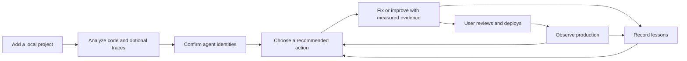

# Agentagon product experience overhaul

Status: implementation plan  
Audience: product, design, frontend, backend, and coding agents implementing the work  
Scope: local dashboard, shared application operations, MCP, workflow runtime, and persistent agent workspaces

## Decision

Agentagon should feel like an always-on AI agent engineer, not a database browser for agent-development primitives.

The product promise is:

> Connect an AI agent project. Agentagon identifies the agents, finds the most important problems and opportunities, helps produce a measured change, and then checks whether production actually improved. Each attempt teaches the next one.

The current implementation contains most of the required technical capabilities. The customer journey is difficult because it exposes `Goals`, `Issues`, `Memory`, `Workflows`, `Connectors`, and `Tasks` as separate objects before the user has obtained an outcome. Users must infer the correct order, repair missing prerequisites themselves, and interpret internal runtime language.

The redesign keeps those domain records and the evidence boundaries behind five user-facing surfaces:

1. **Overview** — what matters now and the next best action.
2. **Agents** — application-agent identity and a workspace for each agent.
3. **Production** — cross-agent issues, releases, monitoring, and health.
4. **Activity** — questions, approvals, active work, and past results.
5. **Settings** — projects, coding backends, connections, execution, privacy, and advanced workflow/memory configuration.



## Audit method and limits

This plan is based on a read-only walkthrough of the running local product at `127.0.0.1:59116` using the registered `/Users/guru/Documents/mili-agent-main` project, followed by inspection of the React routes, shared application service, runtime, domain catalog, storage, HTTP dispatcher, workflow definitions, and MCP tool surface.

The walkthrough covered the welcome page, project home, onboarding, agent inventory and confirmation, task history and task detail, goals, issues and direct Fix, memory, workflow catalog, connectors, all settings sections, and the current agent workspace implementation. No forms were submitted, no workflow was started, no state was mutated, and no automated tests were run.

The running service may not contain every uncommitted source change. Findings describe the customer-visible state that a user encountered. The implementation plan also accounts for newer source capabilities that were not visible in that process, including coding-agent review, responsibility inference, recommendations, improvements, production monitors, and production observations.

The following were not verified during this audit:

- keyboard-only completion of every journey;
- screen-reader announcements and focus restoration;
- zoom, narrow viewport, high-contrast, and reduced-motion behavior;
- live provider imports and live coding-backend sessions;
- service restart, interruption, and resumption behavior;
- performance on projects much larger than the observed project.

These remain release checks, not evidence that the current behavior works.

## Current journey findings

### 1. First launch does not explain the outcome

The welcome page says “Recursive self-improvement for AI agents” and asks the user to add a project. It does not show what will happen next, what is read, whether a Git repository is required, whether traces are optional, or how long first value takes.

**Impact:** the user grants broad local access before understanding the value or bounds.

**Change:** show a three-step value preview directly below the headline: `Analyze your agent`, `Improve with evidence`, and `Watch production`. State “Local folders are supported. Git and observability are optional for the first assessment.”

### 2. Adding a project conflates local folders and cloning

The current modal leads with an optional repository URL and then asks for a project directory. It makes a local folder look like the fallback case and does not offer a folder chooser, path validation, or a preflight summary.

**Impact:** users reasonably assume GitHub is required or do not know whether the directory is a source or clone destination.

**Change:** make `Use a local folder` the primary action and `Clone a repository` a separate secondary path. Do not put both modes in one form.

### 3. Setup is hidden and can preserve invalid choices

The useful setup flow exists at `/onboarding`, but the default project route is Home. The observed setup selected a Braintrust project whose connector said `Needs credentials`. `Save setup` had no clear user value, and the screen mixed important choices with low-level bounds.

**Impact:** the user can start an assessment that is guaranteed to be partial, without a clear preflight result.

**Change:** incomplete projects always open Setup. Run preflight automatically and prevent an unavailable connection from being selected. Replace `Save setup` with autosave and a small `Saved` status.

### 4. Analysis completes before the user knows what “complete” means

The assessment task reported `Completed with limits`, three generic progress steps, and a paragraph saying it retained 29 code-backed candidates. The actionable result was below the chronology.

**Impact:** the user sees a qualified success but not the outcome, limits, or next action at a glance.

**Change:** completed work opens an outcome summary: `29 likely agents found`, `0 traces analyzed`, `Review agent identities`. Explain each limit in one sentence and move runtime events under `Technical details`.

### 5. The project home repeats one action four times

`Review discovered agents` appears in the sidebar, hero band, inventory card, attention card, and attention list. Empty evidence and measured-result cards consume equal space.

**Impact:** repetition creates noise without adding confidence or context.

**Change:** render one primary recommendation and one compact project status row. Do not repeat an action elsewhere on the same screen.

### 6. Agent discovery produces an unreviewable inventory

The observed inventory showed 29 nearly identical cards with a name, path, and `Review`. There was no responsibility, confidence, evidence preview, duplicate grouping, search, filter, rejection, or bulk review.

**Impact:** the user has to open every candidate and manually supply information the product is meant to infer.

**Change:** add an evidence-backed review queue with inferred responsibility, confidence, code excerpt, candidate reason, possible duplicates, and `Confirm`, `Not an agent`, and `Merge with…` actions.

### 7. Responsibility inference is invisible or missing

The confirmation dialog showed a blank Responsibility field for a discovered agent. The source now contains a structured coding review path, but the running user experience did not demonstrate that it ran or why it could not produce a result.

**Impact:** Agentagon asks the user to perform its core semantic discovery work and offers no diagnostic path.

**Change:** responsibility inference is an explicit assessment stage. Every retained suggestion must contain an inferred responsibility or a machine-readable reason such as `coding review unavailable`, `response invalid`, or `not enough surrounding code`. The review UI shows that reason and allows a retry for the affected batch.

### 8. Top-level Goals is a prerequisite page, not a useful destination

Before confirmation, Goals only tells the user to add an agent. Later it duplicates per-agent goal views.

**Impact:** a permanent navigation item often leads to a dead end.

**Change:** remove Goals from global navigation. Goals live inside an agent workspace and are created contextually from a recommendation or `New goal`.

### 9. Issues mixes ingestion plumbing with user decisions

The Issues screen leads with provider formats and a raw JSON/JSONL textarea. Users need to know OTLP, Braintrust, LangSmith, Langfuse, or Phoenix formats before seeing an issue.

**Impact:** trace ingestion technology dominates the problem the user wants to solve.

**Change:** Production shows detected issues first. `Add trace evidence` opens a source chooser with provider, paste, upload, and trace-ID options. Format detection is automatic; advanced format override is collapsed.

### 10. Direct Fix has contradictory inputs and dead ends

The Fix modal requires an agent even when the product should infer ownership from a trace. Its `Selected traces` field can contain `Describe a problem instead`, and it displayed an opaque trace ID with `0 spans`. The start button is disabled without a guided resolution.

**Impact:** the flagship action is blocked at the moment of intent.

**Change:** Fix is a short guided flow that accepts an issue, trace, or description first. Agent ownership is proposed next. Ambiguous ownership becomes a choice with evidence. Expected behavior is a separate field with examples and can be refined by the brain before work starts.

### 11. Workflows exposes implementation primitives

Nine workflows are presented as equal catalog cards. The user must know whether to design, evaluate, baseline, audit, discover, assess, fix, optimize, or observe, and several actions open forms with unmet prerequisites.

**Impact:** users construct the product pipeline themselves.

**Change:** remove Workflows from primary navigation. Expose five contextual intents: `Analyze project`, `Investigate traces`, `Fix issue`, `Improve a goal`, and `Check production`. Keep the full catalog under `Settings → Advanced → Workflows` for expert use and diagnostics.

### 12. Memory exposes storage instead of learning

Memory leads with a folder path and a registration form. It does not first show lessons, where they were used, whether they helped, or their production outcomes.

**Impact:** a differentiating recursive-learning capability looks like filesystem administration.

**Change:** show `Learnings` inside each agent and on the project overview. Move group paths, bindings, and manual record operations to advanced settings. Each learning shows source attempt, result, uncertainty, evidence, and subsequent uses.

### 13. Connections do not communicate readiness

A configured Braintrust connection was marked `Needs credentials` while Braintrust also appeared under available providers. The page offered `Test` and `Disconnect`, with no reconnect action, last import, scope, sample preview, or reason for the state.

**Impact:** users cannot determine whether assessment or monitoring will work.

**Change:** one card per provider connection with `Ready`, `Action required`, or `Unavailable`; exact reason; environment/project scope; credential source; last successful check; last import; and one primary repair action.

### 14. Settings is fragmented and partly empty

Execution showed an empty Profiles card. Defaults contained one `Use runtime traces` select. Project contained only destructive removal. Privacy exposed `Intelligence` without explaining what data leaves the machine.

**Impact:** the product looks unfinished and makes sensitive configuration hard to evaluate.

**Change:** consolidate settings into General, Coding backend, Connections, Execution, Data & privacy, and Advanced. Hide empty sections. Put removal at the bottom of General, not in a dedicated tab.

### 15. Task history uses runtime vocabulary

The page starts with four filters, including a disabled Goals filter, and describes records as tasks and workflows. Completed details prioritize generic progress events such as command execution.

**Impact:** users have to translate implementation state into product outcomes.

**Change:** rename the surface Activity. Default to `Needs you` and `Running`, then completed results. Each row states intent, agent, outcome, and next action. Preserve technical events in a collapsed diagnostics view.

### 16. Empty and blocked states are passive

Many screens say `None`, `No goals yet`, `No tasks yet`, or `Select an agent` without completing the prerequisite in context.

**Impact:** navigation produces dead ends and forces the user to remember where setup lives.

**Change:** every empty or blocked state has one sentence explaining the value, one primary action that resolves the prerequisite, and an optional example. The primary action opens an inline flow and returns the user to the original intent.

### 17. Internal identifiers and storage paths leak into primary UI

Opaque trace IDs, tested revisions, group paths, workflow names, and raw evidence concepts appear before human labels.

**Impact:** the product feels like an internal admin console.

**Change:** show human labels and summaries first. IDs, hashes, paths, raw JSON, and provenance live in expandable Evidence or Technical details sections and remain copyable.

### 18. Accessibility foundations exist, but important states need work

The app has a skip link, semantic headings, landmarks, and labeled form fields. However, tiny uppercase mono labels, muted text, dense drawers, status conveyed mainly through color, and disabled controls with hidden prerequisites are visible risks. Live task updates and focus restoration were not verified.

**Change:** require readable body copy at 16 px or larger, 4.5:1 text contrast, text plus icon for status, 44 px pointer targets, focus trapping and restoration for dialogs, route focus to the page heading, and polite live announcements for task changes. Never rely on a disabled button to explain a prerequisite.

## North-star experience

### The first ten minutes

A first-time AI engineer should be able to complete this sequence without documentation:

1. Click `Use a local folder`.
2. Choose or paste a directory. The UI confirms that non-Git folders work.
3. See a preflight summary: coding backend, detected agent frameworks, likely observability SDKs, Git state, and any blockers.
4. Optionally connect traces or choose `Continue without production traces`.
5. Click `Analyze project` after reviewing time, file, trace, and execution bounds.
6. Watch meaningful incremental results: candidate agents, trace coverage, proposed mappings, issues, and opportunities.
7. Review a grouped list of inferred agent identities with responsibilities and evidence.
8. Confirm at least one agent.
9. Land in that agent’s workspace with one recommended next action.
10. Start a focused Fix, define a goal, or connect production evidence from the same screen.

The interface should never require the user to visit Workflows, Memory, Settings, or a raw trace importer to complete this sequence.

### The recurring weekly loop

1. Open Overview and see only meaningful changes since the last visit.
2. Select a new production issue, a regression, or an unmeasured opportunity.
3. Review why Agentagon recommends action and what evidence is missing.
4. Start the guided action with scope and budget already derived.
5. Answer questions in Activity if expected behavior or ownership is ambiguous.
6. Review the verified result and limitations.
7. Select and deliver a change explicitly.
8. Record or detect its deployment.
9. Watch a matched production cohort and receive a result only when evidence is sufficient.
10. See the resulting lesson cited in later recommendations and attempts.

## Information architecture

### Global shell

The left sidebar contains only:

| Item | Purpose | Badge |
|---|---|---|
| Project switcher | Change the local project or add another | None |
| Overview | Project health and next best actions | Meaningful changes only |
| Agents | Confirmed agents and identity review queue | Unreviewed candidates |
| Production | Cross-agent issues, releases, and monitoring | New issues/regressions |
| Activity | Questions, approvals, active work, and history | Items requiring input |
| Settings | Project and system configuration | Configuration blockers |

Do not place Goals, Issues, Memory, Workflows, or Connectors in the primary sidebar.

The top bar contains:

- project name and current branch or `Not a Git repository`;
- service state: `Local service running`, `Restarting`, or `Disconnected`;
- a single `Needs you` button with count;
- help menu with Getting started, Documentation, Diagnostics, and About;
- theme control with an accessible text label in its menu.

### Agent workspace navigation

Each confirmed agent has these tabs:

1. **Overview**
2. **Issues**
3. **Goals & evaluations**
4. **Improvements**
5. **Production**
6. **Learnings**
7. **Settings**

Do not include a generic Evidence tab. Evidence is attached to the issue, evaluation, improvement, observation, or learning it supports. Do not include a duplicate Activity tab; global Activity can be filtered to the current agent from the agent header.

### Route map

Use stable, outcome-oriented routes:

```text
/projects/:projectId/overview
/projects/:projectId/setup
/projects/:projectId/agents
/projects/:projectId/agents/review
/projects/:projectId/agents/:agentId/overview
/projects/:projectId/agents/:agentId/issues
/projects/:projectId/agents/:agentId/goals
/projects/:projectId/agents/:agentId/improvements
/projects/:projectId/agents/:agentId/production
/projects/:projectId/agents/:agentId/learnings
/projects/:projectId/agents/:agentId/settings
/projects/:projectId/production
/projects/:projectId/activity
/projects/:projectId/activity/:taskId
/projects/:projectId/settings/:section
```

Legacy routes are removed rather than wrapped. Fresh state remains the release policy.

## Exact screen specifications

### Welcome: no projects

**Headline:** `Keep your AI agents improving.`  
**Supporting copy:** `Agentagon analyzes agent code and optional production traces, helps create measured improvements, and checks what changed after deployment.`

Show three compact steps:

1. `Connect code` — `Use any local folder. Git is recommended for measured changes, not required for assessment.`
2. `Find what matters` — `Detect agents, production failures, and unmeasured opportunities.`
3. `Improve and observe` — `Verify changes before selection, then compare production outcomes.`

Buttons:

- Primary: `Use a local folder`
- Secondary: `Clone a repository`
- Text link: `See how Agentagon works`

Footer note: `Runs locally. Agentagon does not modify code, connect providers, or monitor production until you choose those actions.`

Do not use `Add project` as the first CTA. It describes storage, not the user’s intent.

### Add local folder

Open a focused dialog titled `Use a local project folder`.

Fields and actions:

| Element | Exact behavior |
|---|---|
| `Project folder` | Path field with current user home abbreviated visually, full path in accessible name |
| `Choose folder…` | Opens the local host folder picker when available |
| Inline validation | Runs after blur: exists, is directory, readable, duplicate registration, project size warning |
| Detected summary | Shows Git branch or `Not a Git repository`, primary languages, and likely agent frameworks |
| Primary button | `Continue` |
| Secondary button | `Cancel` |

Copy below the field: `Choose the folder that contains the agent application. GitHub is not required.`

If a native folder picker is unavailable, keep the path input and show `Paste an absolute folder path` instead of a nonfunctional button.

### Clone repository

Open a separate dialog titled `Clone a repository`.

Fields:

1. `Repository URL` — required; supports HTTPS and SSH; validate syntax without contacting the remote until submit.
2. `Clone into` — required local parent directory.
3. `Folder name` — derived from URL, editable.

Buttons:

- Primary: `Clone and continue`
- Secondary: `Cancel`

Show clone progress and authentication errors in the dialog. On success, continue to Setup. Never reinterpret an empty repository URL as local-folder mode.

### Project setup

Setup is one page with progressive sections, not a four-card form.

Header:

- Eyebrow: `Project setup`
- Title: `Prepare {project name}`
- Copy: `Agentagon will inspect code and the trace evidence you choose. Assessment is read-only.`
- Autosave status: `Saved` or `Couldn’t save — Retry`

#### Section 1: Project

Show:

- absolute folder path with `Change folder`;
- Git status: branch, revision, clean/dirty, or non-Git;
- detected languages and frameworks;
- file count and exclusions;
- `View scan bounds` disclosure.

No editable fields belong here except `Project name` under an `Edit` action.

#### Section 2: Coding backend

Show one selected backend card and alternatives below it.

Each card contains name, availability, authentication, version, selected model, and exact limitation. Actions are `Use Codex`, `Use Claude`, `Sign in`, or `Configure` depending on state.

Copy for a ready backend: `Ready to analyze this project.`  
Copy for local-only fallback: `Agent detection can run locally. Diagnosis and responsibility inference require a configured coding backend.`

Do not call these “assistants” in settings and “backends” elsewhere. Use `Coding backend` everywhere.

#### Section 3: Production traces

Title: `Production traces` with badge `Optional`.

Default state has two buttons:

- Primary secondary-tone: `Connect observability`
- Secondary quiet: `Add trace file or JSON`
- Text action: `Continue without traces`

Connected state shows provider, provider project, environment, credential readiness, and sample availability. Add `Preview sample` and `Change`.

Never select a connection that is not ready. A connection requiring credentials displays `Reconnect` and cannot be included in the assessment.

Advanced disclosure `Trace bounds` contains:

- `Look back` default 7 days;
- `Maximum completed root traces` default 100;
- environment;
- provider filters;
- estimated availability after a lightweight provider metadata check.

#### Section 4: Analysis summary

Before the CTA, show a sentence assembled from real state:

`Analyze 2,416 eligible files with Codex. Include up to 100 completed production traces from Braintrust / production. Stop after 30 minutes.`

If traces are omitted:

`Analyze 2,416 eligible files with Codex. Production failures and production baselines will remain unknown.`

Primary button: `Analyze project`  
Secondary action after a prior assessment: `View previous results`

The CTA remains enabled for useful partial assessment. Readiness warnings state the missing output instead of blocking unrelated work.

### Assessment progress

After start, route to a full-page assessment view rather than a narrow task drawer.

Header: `Analyzing {project name}` with `Running` status and elapsed time.

Show result-oriented stages:

1. `Scanning code` — candidate count and files considered.
2. `Reviewing likely agents` — batches reviewed, retained, excluded, failed.
3. `Importing selected traces` — traces, spans, completeness, provider warnings.
4. `Matching code and trace identities` — confirmed suggestions, ambiguous matches.
5. `Finding issues and opportunities` — grouped issue and recommendation counts.
6. `Preparing results`.

Each stage has `Waiting`, `Running`, `Complete`, `Limited`, or `Failed`. Show one useful sentence, not command-execution events.

Actions:

- `Run in background` returns to Overview while work continues.
- `Cancel analysis` requires a compact confirmation explaining retained partial evidence.
- `Technical details` opens sanitized runtime events and IDs.

When one stage fails but useful results exist, continue and label the stage `Limited`. The final state explains exactly which outputs are unavailable.

### Assessment result

Title: `Project analysis complete` or `Project analysis complete with limits`.

Top summary cards are outcomes:

- `Likely agents` — confirmed plus review count.
- `Production issues` — count or `Not analyzed`.
- `Improvement opportunities` — evidence-backed and `Not measured yet` counts.
- `Coverage` — eligible files and trace window.

The primary recommendation occupies one card:

`Review 12 likely agents`  
`Agentagon inferred names and responsibilities from 25 files. Confirm identities before repairs or monitoring.`  
Button: `Review agents`

Secondary actions: `Open project overview`, `Analyze more traces`, and `View limits`.

Do not lead with the task transcript. Do not use a generic `Next step` string when a typed action can be rendered.

### Agent inventory

Header:

- Title: `Agents`
- Copy: `Application agents Agentagon can evaluate, improve, and observe.`
- Primary button: `Add agent`
- Secondary button: `Analyze project again`

Below the header, use tabs:

- `Confirmed {n}`
- `Review {n}`
- `Excluded {n}`

Search searches name, responsibility, code path, and trace identity. Filters include source (`Code`, `Traces`, `Manual`), confidence, and ownership state.

Confirmed agent rows show:

- name and responsibility;
- status (`Code only`, `Code + production`, `Trace only`);
- code scope count and environments;
- open issue count and production state;
- primary action `Open workspace`;
- overflow actions `Edit identity`, `Archive`.

Do not use a card grid for more than six agents. Use a compact, responsive list or table with expandable details.

### Agent review queue

This is a dedicated review experience, not a repeated modal.

Header: `Review detected agents` and progress `3 of 12 reviewed`.

The left rail lists candidates grouped by likely component or directory. The main panel contains:

1. `Proposed identity`
   - `Agent name` text field.
   - `Responsibility` textarea prefilled from structured coding review.
   - confidence badge with plain explanation.
2. `Why Agentagon thinks this is an agent`
   - code path;
   - exact symbol/class/function;
   - 20–50 relevant surrounding lines with line numbers;
   - framework signals;
   - trace identity evidence if present.
3. `Code and production mapping`
   - code scopes;
   - shared dependencies;
   - suggested trace selector;
   - conflicts and possible duplicates.

Buttons:

- Primary: `Confirm agent`
- Secondary: `Not an agent`
- Secondary: `Merge with…`
- Quiet: `Skip for now`
- Navigation: `Previous`, `Next`

After a decision, advance automatically and offer Undo for ten seconds. Keyboard shortcuts may be shown only after the first decision.

If responsibility inference failed, show:

`Responsibility could not be inferred because {reason}. Review the code excerpt or retry this batch.`

Button: `Retry inference`. Do not silently present an empty field as a normal result.

Bulk action is available only for high-confidence candidates with a populated responsibility and no duplicate conflict. Label it `Confirm {n} high-confidence agents`; show the exact candidates before applying.

### Project overview

Before any confirmed agent exists, Overview displays the setup or review action and no empty analytics grid.

After confirmation, the page contains:

#### Header

- project name;
- one-line state such as `3 agents · production connected · last analyzed 2 hours ago`;
- primary button chosen from state: `Continue setup`, `Review agents`, or `Analyze project`;
- overflow: `Project settings`, `Reanalyze`, `Open folder` when supported.

#### Needs you

Show at most five meaningful items, sorted by severity and recency. Each item contains cause, affected agent, evidence freshness, and a concrete action. Examples:

- `Confirm ownership for 2 trace-only agents` → `Review mappings`
- `Checkout Agent failed in 18 of 74 recent traces` → `Inspect issue`
- `Fix task needs expected behavior` → `Answer question`
- `Payment Agent latency regressed after release 2026.09.4` → `Review production change`

Hide the entire section when empty. Do not render “Nothing needs your attention” as a large card.

#### Agent health

One row per confirmed agent:

- name and responsibility;
- production state;
- open issues;
- last evaluation and score direction;
- active improvement;
- one recommended action;
- `Open`.

#### Recent outcomes

Show production observations, verified improvements, completed evaluations, and assessment changes as a timeline. Each item says what changed, compared with what, and whether evidence is sufficient.

#### Coverage

A compact footer card shows code scan freshness, production trace coverage, monitored environments, and missing signals. Link `Review coverage` opens the relevant settings or production detail.

Remove the current Agent inventory / Needs attention / Evidence count cards and the repeated onboarding band.

### Agent workspace header

Every agent page begins with:

- agent name;
- editable one-line responsibility;
- identity status chips: `Code`, `Production`, and environment;
- production health summary;
- primary contextual button: `Fix issue`, `Improve agent`, or `Connect production`;
- overflow: `Edit identity`, `View activity`, `Archive agent`.

The primary action is chosen by state, not hardcoded. It must never open a form that is known to be blocked.

### Agent Overview tab

Sections:

1. **Recommended next action** — one recommendation with reason, evidence, uncertainty, prerequisites, and primary CTA.
2. **Health** — open issues, last evaluation, production state, active improvement, and evidence freshness.
3. **Current goals** — up to three active goals with measurement state and latest result; `View all` and `New goal`.
4. **Recent changes** — verified improvements, deployments, and production outcomes.
5. **What Agentagon knows** — concise responsibility, code scopes, trace mapping, and influential learnings; links to details.

If no measurements exist, say `Not measured yet` and offer `Create an evaluation`. Never show zero as if it were a measured value.

### Agent Issues tab

Header buttons:

- Primary: `Investigate traces`
- Secondary: `Report a problem`

Filters: status, severity, environment, release, and time. Default statuses are Open, Investigating, and Regressed.

Each issue row shows:

- title and concise observed failure;
- severity and diagnostic confidence as separate values;
- affected releases/environments;
- occurrences and sample coverage;
- first seen / last seen;
- state: `Open`, `Fix in progress`, `Verified in test`, `Watching production`, `Resolved`, `Regressed`, or `Closed without fix`;
- primary action determined by state.

Issue detail is a full page or wide panel with tabs:

- `Summary` — expected vs observed behavior, impact, uncertainty.
- `Occurrences` — deduplicated trace occurrences and revisions.
- `Diagnosis` — grouped hypotheses and code ownership.
- `Repair attempts` — successful, failed, and incomplete attempts.
- `Production` — recurrence by release and resolution evidence.
- `Evidence` — immutable references, raw IDs, import completeness, redaction.

Buttons: `Start fix`, `Add expected behavior`, `Attach evidence`, `Assign agent`, `Close issue`. `Start fix` is disabled only after the blocking reason is visible and actionable on the same page.

### Add trace evidence

Open from `Investigate traces`, `Attach evidence`, Setup, or Production.

Step 1 asks `Where is the trace?` with four choices:

- `Connected provider`
- `Trace URL or ID`
- `Upload a file`
- `Paste JSON`

Provider mode fields:

- `Connection`
- `Environment`
- `Time window` or `Trace ID`
- optional provider filters under Advanced
- sample availability preview

Upload/paste mode automatically detects the supported format. Display `Detected format: OpenTelemetry` with `Change` under Advanced. Validate before import and report line/record errors without losing entered data.

Before submit show:

- records and byte estimate;
- redaction summary;
- import bounds;
- destination agent if known;
- `Agent ownership will be proposed after import` if unknown.

Buttons:

- Primary: `Import and investigate`
- Secondary: `Import only`
- Cancel

Do not combine import and repair. After investigation, the user chooses an issue to fix.

### Guided Fix flow

Fix is a full-page four-step flow so prerequisites and evidence remain visible.

#### Step 1: Problem

Accepted entry points prefill one of:

- issue;
- imported trace;
- free-text problem.

Fields:

- `What went wrong?` required textarea, prefilled from issue/trace diagnosis.
- `What should happen instead?` required before code editing, but can initially contain a proposal.
- `Affected environment` optional.
- attached evidence list.

Action: `Review expected behavior with Agentagon` asks the brain to propose a clearer statement without starting repair. The user accepts or edits it.

#### Step 2: Ownership and scope

Show proposed agent, code scopes, confidence, and why. If ambiguous, show side-by-side candidate choices. `Confirm ownership` persists the issue mapping; `Use for this fix only` does not silently change the durable agent.

Show files permitted for change and protected evaluation/evidence paths under `Scope`. Advanced users can narrow the permitted paths; expansion requires explicit confirmation with consequences.

#### Step 3: Verification and limits

Show:

- proposed reproduction or regression check;
- existing evaluation coverage;
- missing evidence;
- retry count;
- wall-clock limit;
- coding backend/model;
- estimated number of model sessions, not invented currency.

If no trustworthy verification exists, offer `Prepare a regression check first`. The user may explicitly continue as an unmeasured reviewed patch, which is labeled throughout and cannot resolve the issue as verified.

#### Step 4: Start

Summary sentence:

`Use Codex to reproduce and fix “Checkout tool call loops after timeout” in Checkout Agent. Allow changes in app/checkout/**. Verify with evaluation v3 and two focused retries. Stop after 30 minutes.`

Primary button: `Start fix`  
Secondary: `Back`  
Save state automatically.

### Fix result

Lead with one of:

- `Verified fix ready for review`
- `A patch is ready, but improvement is unmeasured`
- `No verified fix found`
- `Fix needs your input`

Show:

1. outcome and plain-language summary;
2. files changed and diff link;
3. reproduction before/after;
4. regression and guard results;
5. independent review;
6. limitations and unknowns;
7. lessons used or rejected;
8. failed attempts under a collapsed section.

Actions depend on state:

- `Review changes`
- `Select this fix`
- `Prepare local delivery`
- `Create draft pull request` only when configured and authorized
- `Try another approach`
- `Keep original`

Do not offer merge or deployment. Recording a deployment is separate.

### Goals & evaluations tab

Use “goal” only for a durable desired outcome, not every task.

Header:

- Title: `Goals & evaluations`
- Copy: `Define what better means and measure it consistently.`
- Primary: `New goal`

Goal cards show:

- goal name and objective;
- status: `Needs definition`, `Evaluation draft`, `Ready to measure`, `Baseline recorded`, or `Improving`;
- primary metric and direction;
- last baseline/result;
- coverage and important guardrails;
- next action.

New goal flow fields:

1. `What do you want to improve?` with templates: Reliability, Quality, Latency, Cost, Safety, Custom.
2. `Desired behavior` in plain language.
3. `How should improvement be measured?` proposed by Agentagon, editable.
4. `Evidence source` existing traces, dataset, evaluation code, or create new cases.
5. `Guardrails` required behaviors and budgets.

Separate draft measurement design from accepted evaluation. The UI must display when a scoring definition, dataset, judge, or aggregation changed and therefore starts a new comparable series.

### Improvements tab

This tab is a durable history of candidate changes, not a task list.

Use a timeline grouped by goal/issue. Each improvement shows:

- summary and status;
- source issue or goal;
- tested revision and evaluation version;
- baseline vs candidate results;
- selection state;
- delivery and deployment state;
- latest production outcome;
- influential lessons;
- `Open evidence`.

Statuses are `Verified alternative`, `Selected`, `Delivered`, `Deployed`, `Improved in production`, `Regressed in production`, `No material change`, and `Insufficient evidence`. These are separate facets where needed; do not collapse them into a single misleading success badge.

`Record deployment` opens a dialog with:

- `Environment`
- `Release name or version`
- `Actual deployed revision`
- `Deployed at`
- `Linkage source`: user-declared or detected from traces
- optional `Deployment URL`

The dialog states: `This records what was deployed. Production observations determine whether the outcome changed.`

### Production tab for one agent

The top section shows one health statement per monitored environment:

`Production · Improved`  
`Latency decreased 18% for release 2026.09.4 compared with the accepted reference. 1,842/1,910 traces scored; 96% coverage.`

or:

`Production · Insufficient evidence`  
`Only 23 of the required 100 traces are available for release 2026.09.4.`

Sections:

1. `Current release` — release, revision, deployment link, first/last observed.
2. `Measurements` — estimate, comparison, denominator, coverage, uncertainty, definition version.
3. `Open production issues`.
4. `Observation timeline`.
5. `Monitoring settings` summary with `Edit monitoring`.

Buttons:

- `Analyze new evidence`
- `Edit monitoring`
- `Pause monitoring` or `Resume monitoring`
- `Record deployment`

Do not make users enter seconds, GiB, population JSON, and statistical thresholds in one long form.

### Monitoring setup

Use a three-step wizard.

#### Step 1: Scope

- connection;
- provider project;
- environment;
- trace selector preview;
- release field/key detection;
- hourly schedule with presets: Every hour, Every 6 hours, Daily, Custom.

#### Step 2: Measurements

Offer recommended measurements detected from traces: failure rate, latency p95, reported cost, issue recurrence, and accepted quality score. Each selected measurement expands to:

- label;
- source field or scorer;
- better direction;
- minimum samples;
- required coverage;
- material change threshold;
- current and reference window.

Use domain units and percentage inputs. Keep raw field keys under Advanced.

#### Step 3: Review

Render a plain-language policy:

`Every hour, collect up to 100 completed production traces for Checkout Agent. Compare each release’s last 24 hours with the accepted 7-day reference. Require 100 samples and 95% coverage before classification. Diagnose new evidence at most once daily.`

Show storage budget and catch-up bounds under `Resource limits` with sensible defaults. Primary button: `Enable monitoring`.

### Learnings tab

Lead with useful knowledge, not memory groups.

Sections:

- `Influential lessons` — lessons used by recent recommendations or attempts.
- `Recent outcomes` — newly recorded successes, failures, and production updates.
- `Needs review` — contradictory or uncertain lessons.

Each learning shows:

- concise lesson;
- context and hypothesis;
- action and result;
- uncertainty;
- evidence links;
- created/updated time;
- where it was later used or rejected;
- current version.

Actions: `View evidence`, `Mark outdated`, and `Edit note` for user-authored entries. Runtime-authored evidence-linked content is append-only; corrections create a new version.

Project-level improvement learning appears on Overview under a compact `What Agentagon learned` section. Folder locations, access bindings, stable keys, and manual MCP-oriented recall/record tools live in `Settings → Advanced → Memory`.

### Cross-agent Production

This page is the operational home for all confirmed agents.

Header summary:

- monitored agents and environments;
- latest complete observation time;
- collection gaps;
- primary button `Add production connection` only when none exists, otherwise `Investigate traces`.

Views:

- `Health` — one row per agent/environment with release, issues, metric changes, and freshness.
- `Issues` — cross-agent issue inbox.
- `Releases` — deployments and trace-reported cohorts.
- `Coverage` — selectors, sample counts, missing release labels, provider failures, and stale windows.

Only meaningful changes create alert items. Repeated unchanged observations remain in the timeline and do not increment badges.

### Activity

Rename `Tasks` to `Activity` in the UI. Keep `Task` in the runtime and API vocabulary.

Default segmented control:

- `Needs you {n}`
- `Running {n}`
- `Completed`
- `All`

Filters are hidden under `Filter` until used. Available filters are agent, intent, outcome, and date. Do not show a disabled goal filter.

Each row contains:

- human intent, such as `Fix checkout retry loop`;
- agent;
- status and one-sentence outcome;
- current question or next action;
- last update;
- duration for completed work.

Activity detail begins with:

1. result or current question;
2. scope and limits;
3. evidence and artifacts;
4. next available actions;
5. timeline;
6. `Technical details` disclosure for sanitized backend messages and command events.

Generic `Running commandExecution` and `Completed commandExecution` events never appear in the default timeline. Coalesce repetitive tool events into `Inspected 18 files`, `Ran the accepted evaluation`, or another validated summary. Preserve raw events for diagnostics.

Questions appear as a sticky callout with the exact consequence of each answer. The answer is shared with MCP and remains pending after navigation.

### Settings

Use a left sub-navigation on desktop and select menu on narrow screens.

#### General

- project name;
- local folder path and availability;
- Git branch/revision state;
- Agentagon state and evidence paths with `Reveal in Finder` when supported;
- last assessment and `Analyze project again`;
- service version and state schema;
- danger zone with `Remove project from Agentagon`.

Removal dialog requires typing the project name and explains that code and `.agentagon` evidence remain on disk while local service metadata is removed.

#### Coding backend

- detected Codex and Claude cards;
- authentication, version, selected model, and health;
- default backend;
- model chooser populated from the backend, with explicit custom-model advanced option;
- maximum concurrent coding sessions with explanation;
- `Test backend` action;
- exact error and recovery action.

#### Connections

- one section per configured provider;
- status, scope, credential source, last successful check, last import, and monitors using it;
- actions `Reconnect`, `Test`, `Edit scope`, and `Disconnect`;
- available providers exclude already configured identical connections but allow another named connection intentionally;
- `Add connection` opens provider selection.

#### Execution

Show the effective local profile even when no custom profiles exist. Fields/readouts:

- runner type;
- allowed commands or isolation mode;
- working-tree requirements;
- default task time and attempt limits;
- concurrency;
- resource/evidence budget;
- current active sessions.

Custom profiles are an Advanced subsection. Never render an empty card with no action or explanation.

#### Data & privacy

- `Production traces` default: Ask when useful, Include when selected, or Never suggest;
- exact redaction defaults;
- credential storage status;
- evidence retention and current disk use;
- external Intelligence integration in a clearly labeled subsection;
- Intelligence endpoint, connection status, data categories sent, per-request approval/full-access choice, and `Test connection`;
- `Review a sample prepared request`.

Do not use `Intelligence access` without explaining the service or transmitted data.

#### Advanced

- built-in workflow catalog and versions;
- memory group locations and bindings;
- raw provider field mappings;
- diagnostics export;
- service logs;
- experimental features.

Advanced settings are collapsed by default and absent from the normal journey.

## Content and interaction rules

### Vocabulary

| Internal term | Default UI term | Use internal term where |
|---|---|---|
| Task | Activity / run | API, MCP, diagnostics |
| Workflow | Action / intent | Advanced workflow catalog |
| Application agent | Agent | Identity help text when disambiguating coding backend |
| Coding agent | Coding backend | Everywhere user-facing |
| Goal | Goal | Inside an agent workspace |
| Issue occurrence | Trace occurrence | Issue evidence |
| Memory group | Learning storage | Advanced settings and MCP |
| Evidence snapshot | Imported traces / evaluation evidence | Evidence detail |
| Completed with limits | Complete with limits | Result headline plus exact limitations |
| Connector | Connection | Settings and setup |

Do not invent synonyms on different screens. Names in API and Python stay aligned with the domain vocabulary even when UI labels are friendlier.

### Status language

Every status has a noun or consequence:

- `Needs input — confirm expected behavior`
- `Running — reproducing the issue`
- `Complete — verified fix ready`
- `Complete with limits — production traces unavailable`
- `Failed — coding backend session could not start`
- `Interrupted — resume or discard`

Avoid bare `Failed`, `Agent`, `review`, and workflow slugs without context.

### Progressive disclosure

Primary pages show decisions and outcomes. Put these behind disclosures:

- immutable IDs;
- raw JSON;
- code hashes and full revisions;
- filesystem evidence paths;
- provider pagination details;
- command events;
- workflow versions;
- operation IDs;
- raw measurement population objects.

Disclosures use the labels `Evidence`, `Technical details`, or `Advanced`, never `Result details` without describing what is inside.

### Empty states

Every empty state contains:

1. value statement;
2. reason it is empty, when known;
3. one resolving action;
4. optional example.

Example:

`No production data yet`  
`Connect observability or add a trace to find production issues and measure releases.`  
Button: `Add production traces`

Do not render large empty surfaces for informational zeros.

### Errors

Errors contain:

- what failed;
- what useful work was retained;
- likely cause when known;
- one recovery action;
- diagnostics reference behind a disclosure.

Replace `Unsupported coding-agent environment override` with a message such as:

`This assessment requested a coding backend configuration that no longer exists. The code scan was retained. Choose an available backend and retry diagnosis.`

Buttons: `Choose backend` and `Retry diagnosis`.

### Destructive and external actions

Fixing, evaluating, and local branch preparation can proceed from explicit journey starts. Creating a draft pull request, disconnecting a used provider, removing a project, discarding interrupted work, and changing monitoring definitions require review of the concrete effect. Merge and deployment remain outside Agentagon automation.

## Missing capabilities for a dependable product

### P0: required for first value

1. **Setup state machine** with deterministic preflight, autosave, readiness, and resumable progress.
2. **Agent review queue** with responsibility inference outcomes, exclusions, merges, and evidence.
3. **Unified project overview projection** that chooses one next best action and suppresses duplicate cards.
4. **Contextual action launcher** that resolves prerequisites inline instead of opening disabled workflow forms.
5. **Outcome-first activity detail** with sanitized, coalesced runtime events.
6. **Connection readiness model** that prevents invalid connections from being selected.
7. **Automatic trace format detection** and an evidence intake flow that hides provider schemas.
8. **Typed limitations** so partial results can explain missing outputs and offer targeted retries.

### P1: required for continuous maintenance

1. **Canonical agent identity graph** linking code symbols/scopes, trace identities, provider selectors, evaluations, releases, issues, and learnings.
2. **Evaluation coverage map** showing which important behaviors are measured, missing, stale, or invalidated by definition changes.
3. **Release identity and environment mapping** with trace-reported and user-declared provenance kept separate.
4. **Production health timeline** across matched release cohorts and stable measurement definitions.
5. **Issue lifecycle** spanning detection, diagnosis, repair, test verification, deployment, observation, resolution, and regression.
6. **Recommendation engine** that ranks actions by impact, evidence, urgency, effort, and prerequisites and records dismissals.
7. **Attention inbox** for shared questions, approvals, regressions, stale monitors, provider failures, and completed outcomes.
8. **Learning influence view** showing which memory entries were supplied, used, rejected, and later validated or contradicted.
9. **Coverage-aware monitoring** with freshness, gaps, partial imports, provider backoff, and evidence-budget state.
10. **Notification destinations** for meaningful local/system notifications first; email/Slack can follow. Unchanged observations do not notify.

### P2: required for a mature AI engineering platform

1. **Pull-request integration** that publishes only a selected reviewed branch, adds an evidence summary/check, and never merges automatically.
2. **CI integration** to run frozen evaluations against proposed application changes and report comparable results.
3. **Trace-to-evaluation curation** with human review, deduplication, redaction, expected-output authoring, related-case grouping, and held-out sets.
4. **Evaluation debugging tools** for flaky cases, judge disagreements, missing scores, sensitivity, and version comparisons.
5. **Cost and budget accounting** from provider-reported/model-reported usage, with unknown values remaining unknown.
6. **Agent dependency impact analysis** so a shared-code change triggers the required evaluations for every affected agent.
7. **Portable evidence reports** for improvements and production outcomes without exporting raw private traces.
8. **Capability extension SDK** for new trace providers, measurement types, coding backends, and workflow packages.
9. **Team and ownership model** for hosted or shared use later: users, roles, agent owners, approvals, audit log, and secrets boundary.
10. **Project templates** for common frameworks that configure discovery signals and recommended evaluations without hardcoding product logic.

### P3: visionary extensions

1. A project-wide improvement portfolio that allocates a user-approved compute budget across ranked opportunities.
2. Counterfactual replay and shadow evaluation against sampled production traces before deployment.
3. Release canaries that recommend rollback or pause but never execute deployment controls without a separately designed authorization boundary.
4. Cross-project anonymized learning under explicit opt-in and privacy controls.
5. An extensible policy layer for organization-specific evidence, review, and deployment gates.
6. A query assistant that answers “why did this regress?”, “what remains unmeasured?”, and “which lesson affected this fix?” using cited local evidence.

## Backend architecture

### Current architectural problems

The shared runtime and immutable evidence boundaries are good foundations. The main problems are responsibility concentration and projection leakage:

- `workflows/service.py` contains a large `Application` class that coordinates projects, agents, goals, tasks, datasets, connections, delivery, settings, and backend discovery.
- `domain/catalog.py` combines validation, discovery preferences, coding review, trace matching, agents, goals, evaluation binding, readiness, and metrics.
- `dashboard/server.py` manually parses URL segments and dispatches every resource.
- `frontend/src/pages.tsx` and `lifecycle.tsx` combine data fetching, forms, workflow starts, monitoring policy authoring, and rendering.
- the frontend joins several raw resource responses to decide state that should be authoritative in an application projection.
- generic record storage makes it easy for unrelated features to depend on unversioned payload shapes.
- workflow definitions describe inputs and outputs, but the UI still contains workflow-specific routing and prerequisite logic.

Do not solve this by introducing a generic enterprise framework or by rewriting the execution engines. Extract clear use cases and projections around the existing validated capabilities.

### Target package structure

Add an explicit application layer while retaining the product packages:

```text
src/agentagon/
  application/
    projects.py
    setup.py
    agents.py
    evidence.py
    issues.py
    goals.py
    improvements.py
    production.py
    activity.py
    settings.py
    projections.py
    commands.py
    errors.py
  dashboard/
    app.py
    routes/
    schemas/
    assets/
  brain/
  workflows/
    runtime.py
    scheduler.py
    packages/ or existing built-in directories
  memory/
  capabilities/
    discovery/
    traces/
    evaluation/
    execution/
    optimization/
    git/
    delivery/
    intelligence/
  domain/
    projects.py
    agents.py
    goals.py
    issues.py
    evaluations.py
    improvements.py
    monitoring.py
    recommendations.py
    activity.py
    events.py
  storage/
    metadata.py
    repositories/
    evidence.py
    workspace.py
  mcp/
    server.py
    schemas.py
```

`application/` owns user-facing use cases and authorization of state transitions. `domain/` owns records, invariants, and state changes. `capabilities/` performs bounded technical work. `workflows/` coordinates durable tasks. HTTP and MCP translate inputs and call the same application methods.

### Application operations

Use one operation per user intent. Each operation has a typed command and typed result. Do not expose repository objects directly.

Required operations:

```text
projects.register_local_folder
projects.clone_repository
projects.get_setup
projects.update_setup
projects.start_assessment
projects.get_overview

agents.list_inventory
agents.get_review_queue
agents.confirm_candidate
agents.reject_candidate
agents.merge_candidate
agents.retry_inference
agents.get_workspace
agents.update_identity

evidence.preview_import
evidence.import_and_investigate
evidence.list_coverage

issues.list
issues.get
issues.update_expected_behavior
issues.assign_agent
issues.start_fix
issues.close

goals.create
goals.update
goals.propose_measurement
goals.accept_measurement
goals.start_baseline
goals.start_optimization

improvements.list
improvements.get
improvements.select
improvements.prepare_delivery
improvements.record_deployment

production.get_overview
production.configure_monitor
production.control_monitor
production.analyze_now
production.list_observations

activity.list
activity.get
activity.answer
activity.cancel
activity.resume
activity.discard

settings.get
settings.update_backend
settings.update_connection
settings.update_execution
settings.update_privacy
```

Every mutating command includes `operation_id`, expected record revisions where applicable, and actor/interface metadata. Retries with the same operation ID and same command return the original result. A changed command with the same ID is rejected.

### Domain records and state machines

Keep these records distinct:

| Record | Required responsibility |
|---|---|
| `Project` | Folder identity, display name, availability, setup state |
| `AgentCandidate` | Proposed identity, sources, inferred responsibility, review status, diagnostics |
| `Agent` | Confirmed durable identity and versioned code/trace bindings |
| `Goal` | Desired outcome and accepted measurement relationships |
| `Issue` | Stable problem identity, state, ownership, expected behavior |
| `IssueOccurrence` | Deduplicated trace/evidence occurrence and provenance |
| `EvaluationDefinition` | Versioned accepted behavior, data, scoring, guardrails |
| `EvaluationRun` | Execution against a specific source and definition |
| `Improvement` | Verified candidate and its test/selection/delivery relationships |
| `Deployment` | Declared or trace-reported release/environment linkage |
| `Monitor` | Saved acquisition and measurement policy |
| `Observation` | Immutable bounded production measurement result |
| `Recommendation` | Ranked proposed action, evidence, prerequisites, disposition |
| `Task` | Durable workflow execution, budgets, questions, controls |
| `AttentionItem` | User-actionable projection with deduplication and resolution |
| `MemoryEntry` | Versioned advisory lesson with evidence references |

Suggested state machines:

```text
AgentCandidate: proposed -> confirmed | rejected | merged | stale
Issue: open -> investigating -> fix_in_progress -> verified_in_test
       -> observing -> resolved | regressed | closed
Task: queued -> preparing -> running -> needs_input -> running
      -> completed | completed_with_limits | failed | cancelled | interrupted
Improvement: verified_alternative -> selected -> delivered -> deployed
             -> observed; production outcome is a separate classification
Recommendation: active -> accepted | dismissed | completed | stale
Monitor: enabled | paused | blocked | stale; pending task is a separate link
```

Do not encode production recovery as an Issue boolean. Resolution requires an accepted production observation or an explicit user decision, with provenance.

### Agent identity graph

Implement identity as explicit nodes and evidence-backed edges:

```text
Agent
  -> CodeBinding(path, symbol, revision, confidence, source)
  -> TraceBinding(provider, project, selector, environment, confidence, source)
  -> EvaluationBinding(definition_version)
  -> ReleaseBinding(environment, release, revision, provenance)
```

Suggested and confirmed edges remain separate. Name similarity is supporting evidence, never sufficient by itself. Merging candidates records redirects and preserves original evidence. Trace-only agents are valid; Fix requires a confirmed code binding or a user choice for that task.

### Responsibility inference contract

The deterministic scanner produces bounded candidates and code excerpts. The coding backend reviews batches with a versioned structured schema:

```json
{
  "contract_version": 1,
  "candidates": [
    {
      "candidate_id": "candidate_...",
      "keep": true,
      "name": "Checkout Agent",
      "responsibility": "Resolves checkout questions and executes checkout tools.",
      "confidence": "high",
      "evidence": ["class CheckoutAgent", "system prompt excerpt"],
      "possible_duplicate_ids": [],
      "limitations": []
    }
  ]
}
```

Validate candidate IDs and files against the saved scan. Persist batch status, request/session identity, schema errors, and retry count. A batch failure must not erase deterministic candidates. The projection exposes `responsibility_status` and `responsibility_failure_reason` so the UI never has to infer why a field is empty.

### Recommendations and attention

Recommendations are durable, recomputable records. They contain:

- project and optional agent;
- typed intent and input;
- title and rationale;
- evidence references;
- impact, confidence, urgency, and estimated effort bands;
- prerequisites with resolving operations;
- freshness and invalidation keys;
- disposition and user reason.

Rank with explicit deterministic policy over accepted evidence. The brain may diagnose and propose; validated code determines whether prerequisites and evidence exist. Do not use an opaque universal score. The projection returns one primary recommendation and a short ordered list.

Attention items are separate from recommendations. Attention means the user must decide or repair configuration. Use stable deduplication keys such as `task:{id}:question:{id}` or `monitor:{id}:credentials`. Resolve an item when the underlying state changes. Unchanged monitoring observations do not create new items.

### Projection layer

The frontend should load page-specific read models rather than join raw records. Required projections:

```text
ProjectSetupProjection
ProjectOverviewProjection
AgentInventoryProjection
AgentReviewProjection
AgentWorkspaceProjection
AgentIssuesProjection
AgentGoalsProjection
AgentImprovementsProjection
AgentProductionProjection
AgentLearningsProjection
ProductionOverviewProjection
ActivityListProjection
ActivityDetailProjection
SettingsProjection
```

Each projection includes:

- `state_version` and `generated_at`;
- human labels and summaries;
- typed status and limitations;
- available actions with blocking reasons;
- evidence freshness;
- URLs for supported navigation;
- raw IDs only where controls need them.

Represent actions as data:

```json
{
  "id": "review_agents",
  "label": "Review 12 agents",
  "kind": "navigate",
  "href": "/projects/.../agents/review",
  "enabled": true,
  "reason": null
}
```

The frontend renders actions and does not duplicate workflow readiness logic.

### Storage

Continue to keep mutable application metadata in SQLite and immutable evidence in project-local storage. Introduce repository modules so no application operation accesses generic record kinds directly.

For fresh state version 5, use typed index tables for records that require frequent cross-resource queries:

- agents and agent candidates;
- goals;
- issues and occurrences;
- tasks and questions;
- improvements and deployments;
- monitors and checkpoints;
- recommendations and attention items;
- operation receipts;
- memory group registry.

Versioned JSON payloads can remain inside those rows for feature-specific detail, but identifiers, project/agent relationships, state, revision, timestamps, and deduplication keys must be columns with constraints and indexes.

Add an append-only `domain_events` table and transactional outbox. This is not full event sourcing. It provides reliable projection invalidation, SSE updates, scheduler wakeups, memory outcome retries, and future notifications without coupling those effects to request handlers.

Evidence references contain kind, immutable ID, checksum, project-relative location, redaction version, producer, and creation time. Application metadata points to evidence; it never copies mutable evidence payloads into multiple records.

### Workflow runtime

Preserve one task runtime for dashboard, MCP, scheduler, and managed brain sessions. Add these concepts:

- typed `TaskIntent` separate from workflow package ID;
- stage definitions with user-facing names and progress metrics;
- typed limitation codes;
- typed result summaries and available actions;
- coalesced public events separate from raw diagnostic events;
- durable prerequisite questions;
- operation receipts for external sessions and provider requests.

Workflow packages continue to contain definition, instructions, handler, and helpers. Extend each definition with:

```json
{
  "intent": "fix_issue",
  "entry_inputs": ["issue", "trace", "description"],
  "public_stages": [],
  "result_schema": "fix-result-v2",
  "capabilities": [],
  "prerequisite_resolvers": []
}
```

Do not make the frontend interpret arbitrary workflow input arrays. An application operation prepares a validated task request from user intent. Expert MCP callers may use the generic start contract, but receive the same readiness and typed limitation responses.

### Scheduler and production acquisition

The scheduler claims due windows transactionally using stable operation IDs. It does not execute provider or brain work while holding a database transaction. Persist:

- last durable acquisition checkpoint;
- requested and completed windows;
- overlap for late records;
- current unresolved task;
- backoff state;
- evidence budget state;
- last complete observation;
- next due time.

On restart, reconcile unresolved tasks before scheduling. Catch up one bounded aggregate window, not one task per missed interval. Provider failure for one monitor does not block others.

### HTTP interface

Replace manual URL-segment dispatch with a typed router. FastAPI with Pydantic and Uvicorn is the preferred implementation because it provides explicit request/response schemas, route grouping, generated OpenAPI, dependency-scoped local authentication, file upload support, and streaming responses. Bind only to loopback and preserve exact-origin/session protections.

Route handlers do only four things:

1. authenticate the local interface;
2. validate transport input;
3. call one application operation;
4. translate the typed result or application error.

Use stable error bodies:

```json
{
  "error": {
    "code": "coding_backend_unavailable",
    "message": "Codex is not signed in.",
    "retained": ["Code scan with 29 candidates"],
    "actions": [{"id": "configure_backend", "label": "Configure Codex", "href": "..."}],
    "diagnostic_id": "diag_..."
  }
}
```

SSE publishes projection invalidation keys and task public events. It never sends raw model messages or secrets.

### MCP interface

MCP calls the same application operations and exposes outcome-oriented tools in addition to expert primitives:

- `setup_project`
- `assess_project`
- `review_agent_candidates`
- `inspect_agent`
- `investigate_traces`
- `start_issue_fix`
- `start_goal_improvement`
- `inspect_activity`
- `answer_activity_question`
- `inspect_production_health`
- `configure_production_monitor`
- `recall_agent_learnings`
- `record_agent_learning`

Keep the generic workflow start tool for advanced clients, but document the intent tools first. Every start returns task ID, state, dashboard URL, and typed limitations immediately. MCP disconnection does not cancel tasks.

### Frontend structure

Split the React app by product surface:

```text
frontend/src/
  app/
    App.tsx
    routes.tsx
    queryClient.ts
  components/
    actions/
    data-display/
    feedback/
    forms/
    layout/
  features/
    setup/
    overview/
    agents/
    issues/
    goals/
    improvements/
    production/
    activity/
    learnings/
    settings/
  api/
    client.ts
    generated.ts
    errors.ts
  design/
    tokens.css
    components.css
    utilities.css
```

Each feature owns routes, page components, queries, mutations, forms, and view-model adapters. Shared components contain no project-domain fetching. Generate TypeScript transport types from OpenAPI; keep view models local and explicit.

Retain TanStack Query. Use route loaders only for route-critical identity. Mutations invalidate projection keys returned by the server instead of manually guessing every raw resource key.

Create these reusable components before page migration:

- `AppShell`
- `PageHeader`
- `PrimaryRecommendation`
- `ActionButton`
- `StatusBadge`
- `CoverageBadge`
- `EmptyState`
- `InlineBlocker`
- `EvidenceDisclosure`
- `OutcomeSummary`
- `ActivityTimeline`
- `ReviewQueue`
- `StepFlow`
- `FormField`
- `ConfirmDialog`
- `ToastRegion`
- `Skeleton`

Forms keep user input after server errors and route navigation when safe. Every async action shows pending text such as `Analyzing…`, prevents duplicate mutation by operation ID, and supports retry with the same operation ID after an uncertain response.

### Extensibility contracts

New integrations implement explicit ports:

```text
TraceProvider
  discover_projects
  validate_credentials
  preview
  acquire_window
  acquire_trace

CodingBackend
  detect
  validate
  list_models
  start_session
  resume_session
  cancel_session

MeasurementAdapter
  validate_definition
  score
  summarize
  compare

WorkflowPackage
  definition
  prepare
  handle
  summarize_result
```

Register adapters through code entry points or a built-in registry with versioned capability metadata. Do not let provider-specific fields leak into agents, monitors, or UI components; store them in validated adapter configuration and expose human summaries.

## Implementation sequence

### Phase 0: Freeze the product contract

1. Add this document as the implementation source of truth.
2. Write a route and vocabulary removal checklist.
3. Define typed public statuses, limitation codes, and available-action schema.
4. Define fresh state version 5 and confirm that no migration or compatibility routes will ship.
5. Capture the current manual walkthrough states for later comparison.

Exit criteria:

- every current top-level route maps to a target route or explicit deletion;
- every public noun maps to the vocabulary table;
- all product boundaries in `product-decisions.md` remain represented.

### Phase 1: Application operations and projections

1. Create `application/` and move orchestration out of `workflows/service.py` one use case at a time.
2. Add repository interfaces around current SQLite/evidence storage.
3. Implement typed errors, limitations, actions, and operation receipts.
4. Build Setup, Overview, Agent inventory/review, Activity, and Settings projections.
5. Add domain events and the transactional outbox.
6. Keep the existing runtime and capability engines unchanged behind the operations.

Exit criteria:

- HTTP and MCP can call the same setup, assessment, agent-review, and activity operations;
- projections contain all labels, blockers, and actions needed by the frontend;
- no frontend-specific wording is generated by workflow handlers;
- duplicate submissions remain idempotent.

### Phase 2: New shell and first-use journey

1. Implement the five-item global navigation.
2. Replace the welcome and Add project modal with separate local-folder and clone journeys.
3. Make Setup the default route until one assessment is complete and at least one agent is confirmed or explicitly skipped.
4. Add deterministic preflight and autosave.
5. Build assessment progress and outcome pages using public stages.
6. Remove the current Setup banner and repeated home actions.

Exit criteria:

- a non-Git local folder can reach assessment without entering a repository URL;
- an unavailable provider cannot be silently selected;
- code-only assessment clearly states unavailable production outputs;
- leaving and returning resumes the same setup state.

### Phase 3: Agent identity and review

1. Persist `AgentCandidate` separately from confirmed `Agent`.
2. Make deterministic discovery, structured coding review, and trace matching separate recorded stages.
3. Add responsibility status/failure diagnostics.
4. Implement confirm, reject, merge, undo, retry, and bounded bulk confirm.
5. Build inventory search and filters.
6. Route confirmation to the new agent workspace.

Exit criteria:

- no candidate shows an unexplained blank responsibility;
- every decision preserves supporting evidence;
- uncertain mappings remain suggested;
- duplicate and excluded candidates remain auditable without cluttering the confirmed inventory.

### Phase 4: Agent workspace and contextual actions

1. Implement the seven agent tabs and workspace projection.
2. Move Goals, Issues, Improvements, Production, and Learnings under agents.
3. Add contextual action launcher and prerequisite resolution.
4. Replace raw workflow modals with the guided Fix and goal flows.
5. Move the workflow catalog to Advanced.
6. Remove global Goals, Issues, Memory, and Workflows routes.

Exit criteria:

- no primary CTA opens a form already known to be impossible to submit;
- trace-driven Fix starts without a saved goal;
- ambiguous ownership is resolved in the flow;
- goals and evaluations remain versioned and evidence-bound.

### Phase 5: Activity and evidence presentation

1. Add attention items and `Needs you` segmentation.
2. Create public task summaries and coalesced events.
3. Implement full-page outcome-first detail with sticky questions.
4. Put raw runtime messages, commands, IDs, and artifacts behind Technical details.
5. Render typed errors and retained partial work.

Exit criteria:

- generic command-execution chatter is absent from default views;
- completed activities lead with outcome and next action;
- dashboard and MCP show the same question and answer state;
- interruption exposes resume or discard without duplicate execution.

### Phase 6: Production loop

1. Implement cross-agent Production and per-agent Production projections.
2. Replace the monitoring form with the three-step wizard.
3. Add release identity mapping, measurement series, coverage, gaps, and freshness.
4. Create issue lifecycle transitions tied to test and production evidence.
5. Add meaningful-change attention items and local notifications.
6. Add Learning updates when production conclusions materially change.

Exit criteria:

- a verified fix never appears as production recovery before accepted evidence;
- mixed releases and changed measurement definitions are not compared;
- stale and insufficient evidence remain explicit;
- restart and catch-up do not duplicate windows or issue occurrences.

### Phase 7: Settings and advanced administration

1. Consolidate settings into the six target sections.
2. Add connection repair actions and exclude duplicate “available” cards.
3. Show the effective execution profile even without custom profiles.
4. Explain trace, redaction, storage, credential, and Intelligence behavior.
5. Move memory groups and workflow catalog into Advanced.
6. Add diagnostics export that excludes raw secrets and private trace content by default.

Exit criteria:

- no settings page is blank;
- each non-ready integration has one obvious repair action;
- sensitive external data flow is reviewable before authorization;
- destructive actions show their concrete local effect.

### Phase 8: Platform integrations

1. Add outcome-oriented MCP tools while retaining advanced generic starts.
2. Add draft pull-request publication from selected verified improvements.
3. Add CI evaluation reporting.
4. Add trace-to-evaluation curation.
5. Publish extension contracts for providers, measurements, backends, and workflow packages.

Exit criteria:

- every interface calls the same application operations;
- publication is explicit and idempotent;
- merge and deployment remain user-controlled;
- adapter-specific fields do not leak into shared domain records.

## File-level execution map

The implementing agent should use this map rather than editing the current monolith in place indefinitely.

| Current area | Action |
|---|---|
| `frontend/src/App.tsx` | Reduce to providers, shell, error boundary, and route registration |
| `frontend/src/pages.tsx` | Split by feature, then delete |
| `frontend/src/lifecycle.tsx` | Move setup, recommendations, improvements, and production into feature folders, then delete |
| `frontend/src/components.tsx` | Split reusable presentation from domain-aware components |
| `frontend/src/types.ts` | Replace transport types with generated schemas and local view models |
| `frontend/src/styles.css` | Split tokens, components, and feature styles; remove selectors with deleted routes |
| `src/agentagon/workflows/service.py` | Move user-facing orchestration into `application/`; leave workflow/runtime coordination only |
| `src/agentagon/domain/catalog.py` | Split agent, goal, evaluation, and discovery repositories/services |
| `src/agentagon/dashboard/server.py` | Replace manual path dispatch with typed route modules |
| `src/agentagon/domain/projections.py` | Split page projections by surface and make actions/limitations typed |
| `src/agentagon/workflows/runtime.py` | Add public stages, typed summaries, typed limitations, and public/raw event separation |
| `src/agentagon/workflows/production_runtime.py` | Retain assessment/observation preparation; remove UI-oriented recommendation formatting |
| `src/agentagon/storage/metadata.py` | Introduce version 5 typed indexes, repositories, events, and operation receipts |
| `src/agentagon/mcp/server.py` | Call application operations and add outcome-oriented tools |

Delete superseded routes, components, API methods, projections, copy, and styles immediately after each target slice owns all active consumers. Do not add compatibility wrappers.

## Manual acceptance journeys

These are behavioral review scripts. They do not replace automated correctness checks required before release.

### Journey A: local code only

1. Start with no projects.
2. Choose a non-Git local folder.
3. Continue without traces.
4. Confirm the analysis summary states production limitations.
5. Review agent candidates with inferred responsibilities.
6. Confirm one agent and reach its workspace.
7. Create a reliability goal and see `Not measured yet` rather than a numeric zero.

### Journey B: connected production

1. Add a project with a ready provider connection.
2. Preview sample availability and analyze seven days / 100 roots.
3. Review code-only, trace-only, matched, and ambiguous identities.
4. Inspect a grouped issue with multiple occurrences.
5. Start Fix from the issue without creating a goal.
6. Verify the activity view asks for expected behavior if ambiguous.
7. Review a verified candidate and record a deployment.
8. Enable monitoring and inspect insufficient evidence before the minimum sample count.
9. Confirm a later accepted observation changes the production outcome and learning.

### Journey C: pasted trace

1. Open Investigate traces from an agent.
2. Paste supported JSON without selecting a format.
3. Review detected format, redaction, and import bounds.
4. Import and investigate.
5. Resolve ambiguous agent ownership.
6. See several distinct issues when supported by the same trace.
7. Reimport the same trace and confirm no duplicate occurrence is shown.

### Journey D: degraded dependencies

1. Use a project with no authenticated coding backend and a stale provider credential.
2. Confirm deterministic code scan remains available.
3. Confirm unavailable responsibility/diagnosis stages explain what was retained.
4. Repair the backend from the blocker action and retry only the missing stage.
5. Reconnect the provider without reentering unrelated setup.

### Journey E: interruption

1. Start a Fix and close the browser.
2. Reopen and see it under Running.
3. Stop the local service during external work.
4. Restart and see Interrupted with `Resume` and `Discard`.
5. Resume with the same task and external session identity.
6. Confirm no duplicate task, candidate, provider import, or issue occurrence.

### Journey F: accessibility review

1. Complete setup, candidate review, and Fix launch with keyboard only.
2. Confirm every modal traps focus and restores it to the trigger.
3. Confirm route changes focus the page heading.
4. Confirm task updates and errors are announced once.
5. Verify status remains understandable without color.
6. Review at 200% zoom and at 390 px width without horizontal page scrolling.
7. Verify text and controls against WCAG AA contrast and target-size expectations.

## Implementation rules for coding agents

1. Implement one phase at a time and keep the application runnable after each phase.
2. Start each slice by naming the user journey, target projection, operations, and records it owns.
3. Do not add another top-level navigation item to solve a missing contextual action.
4. Do not put raw IDs, paths, JSON, workflow names, or command events in a default view.
5. Do not compute domain readiness independently in React.
6. Do not let a workflow handler write UI copy outside typed stage/result fields.
7. Do not treat a disabled button as sufficient prerequisite guidance.
8. Do not silently merge agent identities, issue occurrences, releases, or measurement series.
9. Do not turn unknown cost, missing traces, absent exceptions, or incomplete evaluation into success.
10. Do not equate verified code improvement, selected candidate, delivery, deployment, and production recovery.
11. Preserve operation IDs and expected revisions for every mutation.
12. Keep raw evidence immutable and mutable product state in SQLite.
13. Keep provider calls, model calls, Git operations, and evaluation execution outside database transactions.
14. Preserve failed attempts, dominated alternatives, incomplete observations, and uncertainty.
15. Make all external publication and deployment-related transitions explicit and reviewable.
16. Remove old consumers and dead code as soon as the replacement is active; no compatibility layer is required.

## Release standard

The redesign is ready when a new AI engineer can add a local folder, understand the assessment bounds, confirm an inferred agent identity, act on one evidence-backed recommendation, and understand the result without opening documentation or seeing the workflow catalog.

It is dependable when the same engineer can connect a deployment to a verified improvement, see a truthful production comparison with coverage and uncertainty, and inspect which prior lessons influenced the next attempt.

The product should feel simple because the system assembles the workflow, prerequisites, evidence, and next action. The underlying rigor remains visible whenever the user asks for evidence or technical detail.
