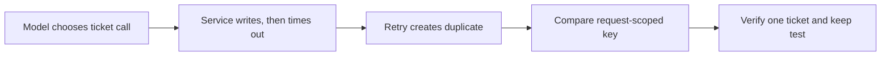

# Repair a ticket retry that creates duplicates

Run a small agent whose model chooses ticket-tool calls. Its Python dispatch layer retries a timeout after the service has already created the ticket, creating a duplicate. Compare a repair using the request ID as an idempotency key, preserve ordinary creation and distinct requests, and deliver a regression test that needs no model access.

This is a **seeded example** using an actual `gpt-5.5` model through authenticated Codex CLI and a controlled, resettable ticket service. It measures the retry behavior in this small application. The model alias is explicit; the provider's resolved model version and monetary cost are unavailable. No customer incident, real ticket API or production result is claimed.



## Prepare the example

Use Python 3.12+, Git, an installed Agentagon checkout, and Codex CLI signed in with access to `gpt-5.5`. The CLI must support `exec --output-schema --ignore-user-config --ephemeral`; the example keeps its model call separate from your coding host's author/reviewer roles. Existing global CLI skills can contribute token overhead. It needs model network access when measurements run.

From the Agentagon repository root with its environment active:

```sh
export AGENTAGON_CONFIG="$(mktemp -d)/config.json"
python examples/ticket-retry/demo.py /tmp/my-ticket-agent --repetitions 2
```

Choose a new application path. The script refuses to overwrite an existing directory. It creates a local Git application and bare review destination, an isolated evaluation draft, a `ticket-demo` profile, and a plan under the example's ignored `.agentagon/demo/`. No model runs or independent reviews happen during this setup. Keep the displayed configuration environment for subsequent commands.

The default preparation budget permits eight trials; a clean first validation uses four. The separate fix budget permits three candidates and eight total trials. Both are serial, capped at 1,800 seconds with a 150-second trial timeout. These are execution limits, not monetary caps. Two repetitions show observed variation only; they do not establish statistical confidence or generalization.

## Validate the evaluation

Use the returned evaluation ID and plan path:

```sh
agentagon --workspace /tmp/my-ticket-agent eval check EVALUATION_ID --plan-file /tmp/my-ticket-agent/.agentagon/demo/plan.json
agentagon --workspace /tmp/my-ticket-agent dashboard
```

The baseline should create one ticket for an ordinary request and two for the timeout case. The `false-completion` negative variant claims success without writing a ticket; all three checks must reject it. Missing or malformed verifier input exits with code 2, which is an execution failure rather than successful sensitivity evidence.

Have a different coding-host agent inspect the exact preparation files, plan, all current trial artifacts and the returned `review_template`. The reviewer checks relevance, sensitivity, provenance, leakage and delivery scope, and writes a completed copy to `.agentagon/demo/evaluation-review.json`. It must preserve the template's binding and use a reviewer distinct from `ticket-demo-author`. Then:

```sh
agentagon --workspace /tmp/my-ticket-agent eval freeze EVALUATION_ID --review-file /tmp/my-ticket-agent/.agentagon/demo/evaluation-review.json
agentagon --workspace /tmp/my-ticket-agent fix start --evaluation EVALUATION_ID --profile ticket-demo
```

The evaluator asserts the recorded ticket count, request identity, title and returned confirmation. A separate deterministic check proves different requests remain distinct. Every benchmark resets the service; candidate files and the evaluator are frozen through the normal engine. Local worktrees are not a machine/network sandbox.

## Compare two proposed changes

Run and independently review the returned baseline using `fix run RUN_ID`, its exact `review_template`, and `fix run RUN_ID --review-file REVIEW_JSON`.

Create each proposed change through `fix new`, copy only the chosen variant into that returned candidate worktree's `application.py`, then use `fix run` and a distinct reviewer. The included variants are known, authored demonstration changes, not claims of autonomous discovery:

| Variant in `.agentagon/demo/` | Behavior to inspect |
|---|---|
| `wrong-key.py` | Removes the duplicate in isolated cases but uses one key for every request. The distinct-request check must reject it even if aggregate completion improves. |
| `fixed.py` | Uses the request ID for retries; ordinary, timeout and distinct-request checks should all pass. |
| `baseline.py` | Original seeded defect, retained to test a later regression. |

Example candidate creation:

```sh
agentagon --workspace /tmp/my-ticket-agent fix new RUN_ID --hypothesis 'Use a request-scoped idempotency key' --author ticket-demo-author
agentagon --workspace /tmp/my-ticket-agent fix run RUN_ID CANDIDATE_ID
```

Apply the variant between these commands, at the exact candidate worktree returned by `fix new`. Do not change the evaluator or copy a variant over the origin application. Inspect every repetition and failed attempt; an incomplete model run is not a measured repair. Use the dashboard's task evidence to inspect actual model decisions and ticket state.

## Keep the test and prove it catches a return of the defect

After inspecting verified alternatives, select the successful repair and prepare local delivery through `ag:ship`, using `fix ship RUN_ID --base main`. The example's `origin` is a local bare Git fixture with the captured `main` baseline. Ship prepares the selected branch, patch and review body locally; this demo creates no GitHub repository or pull request. For a customer application, use its actual destination and obtain publication authorization separately.

The delivery includes `application.py`, `test_ticket_retry.py` and its mock `ticket_environment.py`. It excludes the live-model benchmark, model driver and private workflow records. In a clean checkout of the selected branch:

```sh
python -m unittest test_ticket_retry
```

All three tests must pass. In a disposable copy of that delivered checkout, replace only `application.py` with the retained `baseline.py`; the timeout test must fail while ordinary and distinct requests still pass. Run the same test command on subsequent PRs in existing CI. These retained tests exercise the deterministic retry layer; the live-model benchmark remains separately available for broader agent checks.

For a customer case, use [Bring one failure](../../docs/getting-started/bring-one-failure.md). Establish expected behavior and permitted state from that application before reusing this fixture.
